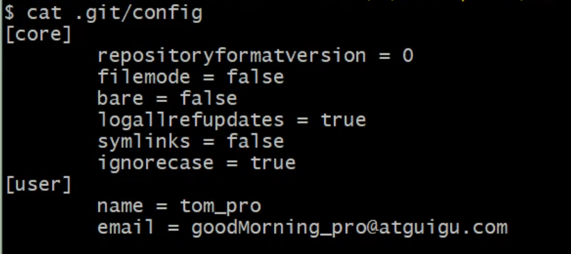

# Git&GitHub——分布式版本控制

## 1.版本控制工具应该具备的功能

- 协同修改
    - 多人并行不悖的修改服务器端的同一个文件。
- 数据备份
    - 不仅保存文件和目录的当前状态，还能保存每一次提交过的历史状态
- 版本管理
    - 在保存每一个版本的文件信息的时候要做到不保存重复的数据，以节约存储空间，提高运行效率。这方面SVN采用的是**增量式管理**的方式，而Git采用**文件系统快照**的方式。
- 权限控制
    - 对团队参与开发的人员进行权限控制
    - 对团队外开发者贡献的代码进行审核——Git独有
- 历史记录
    - 查看修改人、修改时间、修改内容、日志信息
    - 将本地文件恢复到某一个历史
- 分支管理
    - 允许开发团队在开发过程中    多条生产线同时推进任务，进一步提高效率

## 2.版本控制简介

### 2.1 版本控制

工程设计领域中适用版本控制管理工程蓝图的设计过程。在IT开发过程中也可以使用版本控制管理代码的版本迭代。

### 2.2版本控制工具

通过版本控制工具实现版本控制

集中式版本控制工具：

​	CVD、SVN、VSS……

分布式版本控制工具：

​	Git、Mercurial、Bazaar、Darcs……

## 3.Git介绍

### 3.1 Git简介

略

### 3.2 Git的优势

- 大部分操作在本地完成，不需要联网
- 完整性保证
- 尽可能添加数据，而不是删除或修改数据
- 分支操作非常快捷流畅
- 与linx命令全面兼容

### 3.3 Git 安装

安装到非中文无空格目录（任何软件安装须遵循这个原则，防止安装出错）。

具体安装过程，自行百度。

### 3.4 Git本地结构

-  三个区域
    - 工作区
    - 暂存区
    - 本地库

- 文件的5中状态
    - 未追踪
    - 已追踪
    - 已暂存
    - 已提交
    - 已忽略

### 3.5 Git 和代码托管中心

代码托管中心的任务：维护远程库

- 局域网环境下
    -  GitLab 服务器
- 外网环境
    - GitHub
    - 码云

### 3.6 本地库与远程库的交互方式

- 团队内部协作
- 
- 跨团队协作

## 4.命令行操作

### 4.1 本地库初始化

-  命令 git init

-  效果  生成.git文件，默认隐藏

    

-  注意  .git文件中存放着本地库相关的子目录和文件，不要删除，也不要轻易修改。

### 4.2 设置签名

- 形式

    ​	用户名： whm

    ​	邮箱：whm111@163.com

- 作用 区分不同开发人员的身份

- 辨析 设置签名与远程库的用户名、邮箱、密码没有任何关系，只用于区分身份。

- 命令

    - 项目、仓库级别  仅在当前本地库范围生效
        - git **config** user.name whm
        - git **config** user.email whm111@163.com
        - 信息保存位置  .git/config

    

    

    - 系统用户级别 登录当前操作系统的范围（如win10管理员账户）
        - git **config** *--global* user.name whm
        - git **config** *--global* user.email whm111@163.com
        - 信息保存位置  管理员目录下隐藏文件.gitconfig 如：C:\Users\Administrator\.gitconfig

    

    - 级别优先级
        - 就近原则：项目级别优先于系统用户级别
        - 二者都没有是不允许的

### 4.3 具体操作命令

- git status 查看工作区、暂存区信息
    - 分支信息
    - 提交记录
    - 可提交内容 （git add 命令添加到暂存区中文件）
    
- git add .  工作区“新建/修改”的文件添加到暂存区，文件由**未追踪**状态变为**追踪**状态

- git add [file name] 工作区“新建/修改”的文件添加到暂存区，文件由**未追踪**状态变为**追踪**状态

- git rm --cached 文件名  将提交到暂存区的文件撤销，文件回到工作区，文件从**追踪**状态回到**未追踪**状态

- git commt -m ‘提交信息说明’ [file name]  暂存区文件提交到本地库，**不加文件名**，提交暂存区所有文件，**加了文件名**则只提交具体的文件。

- git commit -a 已提交过的文件做了修改，可直接使用此命令提交到本地库，跳过git add这一步

- 查看历史记录

    - git log 日志完整显示，HEAD->master 表明当前版本。

        

        - 多屏显示控制方式
            - 空格向下翻页
            - b向上翻页
            - q退出

    - git log --pretty=oneline

        

    - git log --oneine

        

    - git reflog   指明HEAD版本，HEAD@{num}，到某个版本需要回退num步

        

- 版本前进后退

    - 本质 依赖于|HEAD的指针，指向哪个版本就是哪个版本。

    

    - 基于索引值操作[推荐]

        git reset --hard [hash值一部分]

        

        

    - 使用^符号  只能后退

        git reset --hard HEAD^      "^"有几个，版本回退几次

    - 使用~符号  只能后退

        git reset --hard HEAD~[num]      版本回退num步

    - reset命令三个参数

        - --soft

            - 仅移动本地库HEAD指针

                

        - --mixed

            - 移动本地库HEAD指针

            - 重置暂缓区

                

        - --hard

            - 移动本地库HEAD指针

            - 重置暂缓区和工作区

                
    
- 删除文件找回

    - 前提：删除前文件存在时的状态提交到了本地库，git只会增加新版本，不会删除，本地库永远存在之前版本。
    - 删除操作提交到本地库，回到上一个版本
        - git reset --hard [上一版本]
    - 删除操作未提交到本地库，重回本版本（相当于还未做删除操作）
        - git reset --hard [当前版本]

- 文件比较

    - git diff [file name]     将工作区的文件与暂存区的对应文件比较
    - git diff HEAD(本地库当前版本，或某一个版本) [file name]       将工作区的文件与本地库某一版本中对应文件比较
    - 不带文件名，可比较多个文件

## 5. 分支

### 5.1 什么是分支

Git在版本控制中的表现方式，一个分支代表一条任务线，使用多条线同时推进多个任务

### 5.2 分支的好处

1. 同时并行多个功能模块开发，体改开发效率
2. 各个分支任务开发过程中如果某一分支开发失败不会对其它分支有任何影响。失败分子删除重新开始即可

### 5.3 分支操作

- 创建分支

    - git branch [分支名]

- 删除分支

    - git branch -d [分支名] （不可删除当前分支）

- 恢复被删除的分支

    - git branch [分支名] [部分hash值] 

- 查看分支

    - git branch -v

- 切换分支

    - git checkout [分支名]

- 合并分支

    - 切换到被合并分支上（分支1合并到master，切换到master）
        - git checkout [分支名]（master）
    - git  merge [分支名] （分支1）

- 解决冲突

    - 合并时若产生冲突，合并失败，进去分支合并进行中的状态。

        

    - 冲突表现

        

    - 解决冲突

        - 编辑文件，删除特殊符号
        - 修改文件，根据需要选择保留某一个分支内容或同时保留两个分支内容
        - git add [修改文件名]
        - git commit -m “提交日志“
            - 不得携带具体文件名

## 6. Git基本原理

### 6.1 哈希

哈希是一系列加密算法，不同的hash算法虽然加密强度不同，但有一下几个共同点：

1. 不管输入数据的数据量有多大，同一个hash算法得出的结果长度固定
2. hash算法相同且输入数据相同，得出结果必然相同
3. hash算法相同，但输入数据有一丁点改变，结果必然不同
4. hash算法不可逆，无法通过结果逆推输入数据

hash算法通常用来验证文件：

Git 就是靠这种机制来从根本上保证数据完整性的。

### 6.2 Git保存版本的机制

#### 6.2.1 集中式版本控制工具的文件管理机制

以文件变更列表的方式存储信息。这类系统将它们保存的信息看作是一组基本文件和每个文件随时间逐步积累的差异。

#### 6.2.2 Git文件管理机制

Git 把数据看作小型文件系统的一组快照。每次提交更新时都会对当前的全部文件只做一个快照，并保存这个快照的索引。为了高效，如果文件没有修改Git不会重新存储该文件而是只保存一个链接指向之前存储的文件。所以Git 的工作方式称作快照流。

#### 6.2.3 Git 文件管理机制细节

- Git的“提交对象”

- 提交对象及其父对象形成的链条

### 6.3 Git分支管理机制

6.3.1 分支创建

6.3.2 分支切换

## 7.GitHub

### 7.1创建远程仓库

远程仓库名不需要与本地仓库名一致，**但**为了方便识别，一般**统一**本地仓库和远程仓库名

### 7.2为远程仓库起别名（方便后面使用）

- git remote add [远程仓库别名，一般设置为origin] [远程仓库地址，https/ssh都可]
    - 例：git remote add origin git@github.com:Wang-Hong-Min/LearningNotes.git 
- git remote -v 查看远程仓库别名
    - 
    - fetch 用来拉取代码
    - push用来推送代码，成对。
- 移除远程仓库别名
    - git remote remove [别名]

### 7.3 向远程仓库推送本地仓库文件

git push [远程仓库地址，可用别名，如“origin”] [分支名]

示例：git push origin master

