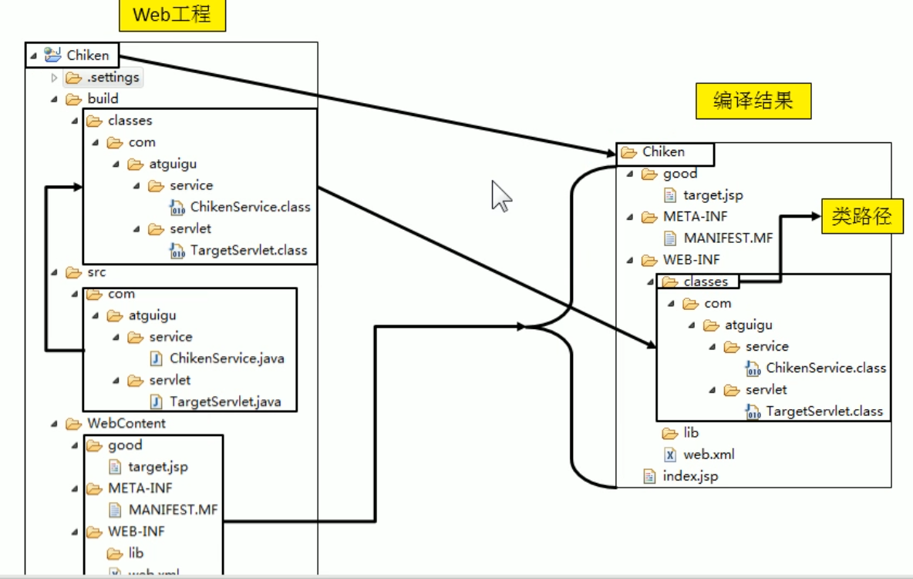
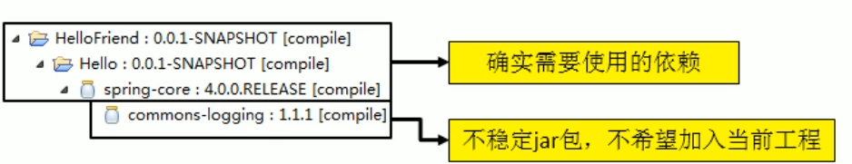
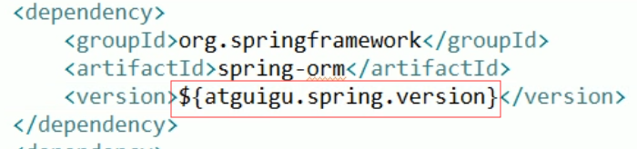

# Maven

技术工具分析


## 1.为什么使用Maven

- 问题1：一个项目就是一个工程

    ​			如果项目非常庞大，就不适合使用package开划分模块。最好是每一个模块对应一个工程，利于分工协作，提高开发效率。

    ​			借助**Maven**可将一个项目拆分多个工程。

- 问题2：项目中的jar包必须手动“复制”、“粘贴”到WEB-INF/lib目录下，导致相同的jar包重复出现在不同的项目工程中。既浪费存储空间，也显得工程臃肿。

    ​			借助**Maven**，可以将jar包仅保存在“仓库”中，需要使用的工程只需要“引用”这个文件的接口，不需要真的吧jar包复制过来。

- 问题3：jar包需要别人准备好，或者到官网下载

    ​			 不同技术的官网提供jar包下载的形式也是五花八门的。有些技术的官网就是通过Maven或者SVN等专门的工具提供下载的。

    ​			如果以不规范的方式下载的jar包，纳闷其中的内容也很可能不是规范的。

    ​			借助Maven就可以以一种规范的方式下载jar包。因为所有知名框架和第三方工具的jar包已经按照统一规范存放在Maven的中央仓库中。以规范的方式下载的jar包，内容也是可靠的。

    ​			 Tips：“统一的规范”不仅仅是对于IT开发领域非常重要，对于整个人类社会也是非常重要的。

- 一个jar包依赖其它的jar包需要自己手动加入项目中。

    ​			jar包之间的依赖关系系非常复杂，如果每个开发人员都需要非常清楚的了解其中的关系，将会大大增加学习成本和负担。

    ​			**Maven**会自动将依赖的jar包导入进来

## 2.Maven是什么

- Maven是一款服务于**Java**平台的**自动化构建**工具

    - Make->Ant->Maven->Gradle（最新，目前Maven最常用）

- 构建

    - 概念：以“Java源文件”、“框架配置文件”、“Jsp”、“HTML”、”图片“等资源为”原材料“，”生产“一个可以运行的项目的过程。

        - 编译
        - 部署
        - 搭建

    - 编译：“Java源文件[.java]——编译——class字节码文件[.class]——交给JVM执行

    - 部署：一个B/S项目最终运行的不是动态Web项目本身，而是这个动态工程“编译的结果”，将“编译结果”拿到Web服务器（如Tomcat）放到指定目录运行的过程为部署。

        - 动态Web工程（生鸡）——编译、部署（对鸡的处理，煮/炸/炒……）——编译结果（熟鸡）

        - 运行时环境

            

            其实是一组jar包的引用，并没有把jar包本身复制到工程中，并不是目录。

        - 项目中资源路径应以编译结果为准，记清楚对应关系

            

    - 搭建

    在实际项目中，除了Java源文件、JSP页面、图片等资源，还整合了第三方框架，它们的jar包和配置文件也必须按照正确的目录结构部署到服务器上。
    
- 构建的各个环节

    1. 清理：将之前编译好的旧的class字节码文件删除，未下一次编译做准备
    2. 编译：将[.java]Java源文件，编译成class字节码文件
    3. 测试：自动测试，自动调用Junit程序
    4. 报告：测试程序执行结果
    5. 打包：动态Web工程大成war包，Java工程打war包
    6. 安装：Maven的特定概念——将打包得到的文件复制“仓库”到指定位置
    7. 部署：将动态web工程打成的war包复制到服务器指定目录，使其运行

- 自动化构建

## 3.Maven怎么用

1. 安装Maven核心程序

    - 官网下载，解压到非中文无空格目录
    - 

2. 配置环境变量，将bin目录添加到path中

    - F:\KaiFa\Eclipse\apache-maven-3.6.1\bin

3. 执行mvn -v命令查看版本信息

    - ```cmd
        C:\Users\Administrator>mvn -v
        Apache Maven 3.6.1 (d66c9c0b3152b2e69ee9bac180bb8fcc8e6af555; 2019-04-05T03:00:29+08:00)
        Maven home: F:\KaiFa\Eclipse\apache-maven-3.6.1\bin\..
        Java version: 1.8.0_221, vendor: Oracle Corporation, runtime: F:\KaiFa\JDK\jdk-8
        Default locale: zh_CN, platform encoding: GBK
        OS name: "windows 10", version: "10.0", arch: "amd64", family: "windows"
        ```

        

## 4.Maven核心概念

1. **约定的目录结构**

2. **POM**

    - 含义：Project Object Model ——项目对象模型

        类似：DOM Document Object Model 文档对象模型

    - pom.xml对于Maven工程师核心配置文件，与构建过程相关的一切设置都在这个文件中配置。相当于动态web工程中的web.xml

3. **坐标**

    - Maven工程中的pom.xml中通多"GroupId"、"ArtifactId“、”verson“（简称**GAV**）三个标签一组唯一定义仓库中的一个Maven工程。

        - GroupID [公司的域名].[公司名].[项目名]

        - ArtfactID [模块名]

        - verson 版本

            

    - 坐标与仓库中路径对应关系

    - 

4. **依赖** **（最重要）

    - Maven解析依赖信息时，会到本地仓库中去寻找被依赖的jar包

        对于我们自己开发的Maven工程，使用mvn install命令安装后就会进入仓库

    - 依赖范围<scope></scope>

        

        

        

    - |          | 主程序 | 测试 | 参与打包 |
        | :------: | :----: | :--: | :------: |
        | compile  |   是   |  是  |    是    |
        |   test   |   否   |  是  |    否    |
        | provided |   是   |  是  |    否    |

    - **依赖的传递性**

        

        - 优点：可以传递的依赖不必在每个模块工程工程中重复声明，建立一个核心模块作为依赖管理模块，其它模块都依赖该模块即可。
        - 注意：非compile范围的依赖不能传递，如有需要，都要声明。

    - **依赖的排出**

        

        - 需要排除commons-logging，排出的依赖在**传递**时同样会被**排除**

            

    - 依赖的原则

        - 解决模块之间jar包冲突问题

        - 路径最短原则，选择最近依赖（2.14）

            

        - 路径相同，先声明者优先。按照pom.xml中的声明顺序选择，如先声明hello就是2.14。

        - 

    - 统一管理依赖版本（方便修改）

        - 在pom.xml中使用properties标签内的自定义标签统一声明版本号

            

        - 在需要统一版本的位置，使用${自定义标签名}引用声明版本号

            

        - properties标签中的自定义标签不仅仅能用于版本管理，**实际**上是定义一个变量，${自定义标签名}引用。

5. 仓库

    - 分类

        - 本地仓库：位于当前电脑上，为电脑上所有的Maven工程服务

        - 远程仓库

            - 私服：假设在当前局域网环境下为当前局域网的所有Maven工程服务

                

            - 中央仓库：假设在互联网上，为全世界所有的Maven工程服务

            - 中央仓库的镜像：假设在各大洲，为中央仓库分担流量。减轻中央仓库的压力，同时更快响应用户请求。

    - 仓库中保存的内容：Maven工程

        - Maven自身所需要的插件
        - 第三方框架或工具的jar包
        - 我们自己开发的Maven工程

6. 生命周期/插件/目标

7. 继承

    - 问题：非compile依赖无法传递，导致各模块依赖版本不同，对团队开发造成影响。

    - 解决：统一各模块中对该依赖的版本：将该依赖统一提取到“父工程”中，在“子工程”中声明该依赖是不指定版本，以”父工程“中版本为准，同时也便于修改。

    - 操作步骤（eclipse）

        1. 创建一个Maven工程作为父工程，打包方式为**pom**

            

        2. 在子工程中声明对父工程的引用

            

        3. 将子工程坐标中与父工程坐标中相同的内容删除，不删也行

            

        4. 在父工程中，声明统一依赖

            

        5. 在子工程中，声明依赖，去除版本号

    - 继承父工程后，必须先安装父工程，才能安装子工程

8. 聚合

    - 作用：一键安装父模块和各个子模块

    - 在“聚合工程（一般就是父工程）”中配置各子模块

        

    - 之后再“聚合工程上执行install即可。


## 5.Maven工程解析Maven

1. 创建约定的目录结构

    1. 根目录——工程名

    2. src——源码

    3. pom.xml——Maven工程核心配置文件

    4. main——存放主程序

    5. test——存放测试程序

    6. Java——Java源文件

    7. resources——存放框架过其他工具的配置文件

        

2. 为什么遵守约定的目录结构

    1. Maven负责项目的自动化构建。以编译为例，Maven想要自动编译，那么Maven必须知道Java源文件在哪。
    2. 如果我们自定义的东西想要框架或工具知道，有两种办法
        - 以配置的方式明确告诉框架
        - 遵守框架内部已经存在的约定
    3. 约定>配置>编码

## 6.Maven常用命令

1. 注意：执行与构建过程相关的命令，必须进入pom.xml文件所在目录。与构建过程相关：编译、测试、打包……
2. 常用命令
    - mvn clean—— 清理
    - mvn compile ——编译主程序
    - mvn test-compile ——编译测试程序
    - mvn test ——执行测试
    - mvn package——打包
    - mvn install ——安装
    - mvn site ——生成站点
3. Maven命令依靠插件执行
    - Maven的核心程序中仅仅定义了抽象的生命周期，但是具体的工作必须有特定的插件来完成。而插件本身并不包含在Maven的核心程序中。
    - 当我们执行的Maven命令需要用到某些插件时，Maven核心程序优先到本地仓库中查找
    - Maven核心程序在本地仓库找不到插件，则需要联网到中央仓库自动下载。

## 7.Maven生命周期

1. 构建各环节的执行顺序：必须按照既定的正确的顺序执行

2. Maven的核心程序中定义了抽象的生命周期生命周期各个阶段的具体任务是由插件来完成的。

3. Maven有三种完全独立的生命周期

    - Clean Lifecycle 在进行真正构建之前执行一些清理操作
    - Default Lifecycle 构建的核心部分，编译、测试、打包、安装、部署等等
    - Site Lifecycle 生成项目报告，站点，发布站点

4. Maven核心程序为了更好的实现自动化构建按照这一特点执行生命周期的各个阶段：无论执行生命周期的哪个阶段，都是从这个生命周期最初的位置开始执行

    

    

5. 插件和目标

    - 生命周期的各个阶段仅仅只定义了要执行的任务是什么

    - 各个阶段和插件的目标是对应的

    - 相似的目标有相同的特定插件完成

        

    - 可以将目标看作“调用插件的命令”

## 8.eclipse和IDEA中配置Maven

- eclipse  每个新工作区都要**重新**设置

    -  Maven插件，eclipse内置，默认使用内置核心程序（不稳定）

    - 修改核心程序，内置不稳定，**推荐**自己下载

        

    - 指定本地Maven仓库位置（指定Maven设置文件，文件中指定仓库位置，和JDK版本）

        

    - pom.xml右键可执行Maven命令

        

- IDEA类似设置，百度。

## 9.自动部署

了解，并不好用。


