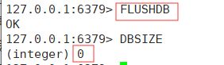
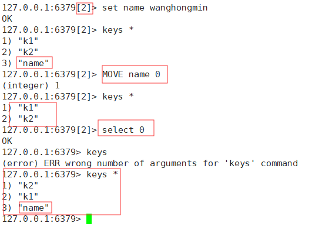
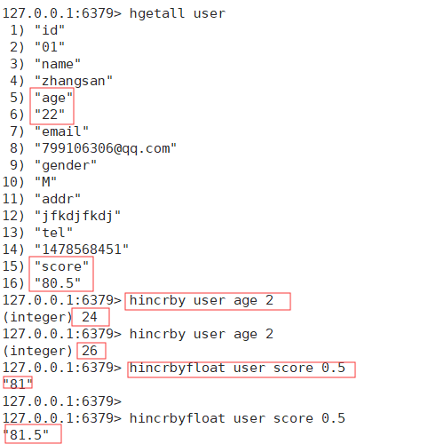
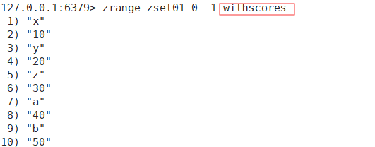
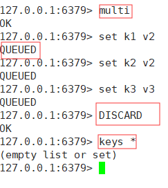

# Redis

## 1.NoSQL入门简介

### 1.1入门概述

#### 1.1.1为什么用NoSQL

数据库演变
- 单机MySQL

    

- Memcached（缓存）+MySQL+垂直拆分

    

- MySQL主从读写分离

    

- 分库分表+水平拆分+MySQL集群

    

- MySQL扩展遇到瓶颈，现在的架构

    

- 为什么用NoSQL

    随着数据量的增长，数据形式的多样化，SQL数据库满足不了我们的需求，如用户的个人信息，社交网络地理位置，用户的生成数据，操作日志等，而**NoSQL**数据库的发展却能很好的处理这些数据。

#### 1.1.2 什么是NoSQL

NoSQL=not only SQL 不仅仅是SQL，泛指非关系型数据库。这类数据的存储不需要**固定的模式**，无需**多余**的操作就能横向扩展。

#### 1.1.3 NoSQL的作用

1. 易扩展

    NoSQL数据库种类繁多，但有一个共同的特点都是去掉关系数据库的关系型特性。数据之间无关系这样就非常容易扩展，也在无形之中，在架构层面带来了可扩展能力

2. 大数据量高性能

    NoSQL数据库都具有非常高的读写性能，尤其是大数据量下同样表现优秀。这得益于NoSQL数据库的无关系性，数据库结构简单。

3. 多样灵活的数据模型

    NoSQL无需事先为要存储的数据建立字段，随时可以存储自定义的数据格式。而在关系型数据库里增删字段是一件很麻烦的事情，尤其是在大数据量的表中增删字段。

#### 1.1.4 NoSQL

- K/V键值对
- Cache 缓存
- Persistence 持久化

### 1.2 3V+3高

- 大数据时代的3V
    - 海量 Volume
    - 多样 Varirty
    - 实时 Velocity
- 互联网需要的三高
    - 高并发
    - 高可扩
    - 高性能

### 1.3 应用


### 1.4 NoSQL数据模型简介

可聚合可分离，类似于json字符串。

### 1.5 NoSQL数据库分类

- K/V键值，典型介绍

    - 新浪 BerkeleyDB+Redis
    - 美团 Redis+tair
    - 阿里、百度 memcache+Redis

- 文档型数据库（多是bson格式），典型介绍

    - CouchDB
    - MongoDB
        - MongoDB是一个基于**分布式文件存储的数据库**，有C++语言编写。旨在为Web应用提供可扩展的高性能数据存储解决方案。MongoDB是一个介于关系型数据库和非关系型数据库之间的产品，是非关系型数据库当中功能最丰富，最像关系型数据库的。

- 列存储数据库

    - Cassandra，HBase
    - 分布式文件系统

- 图关系数据库

    - 专注于构建关系网络图谱，如社交网络、推荐系统等
    - Neo4J、InfoGrid

- 总结

    

### 1.6 在分布式数据库中的CAP原理：CAP+Base

- CAP

    - Consistency 强一致性
    - Availability 可用性
    - Partition tolerance 分区容错性

- CAP的3进2

    - 分布式存储系统最多实现上面两点，而由于当前网络肯定会出现延迟丢包等问题，所以分区容错性**必须**实现，所以我们只能在**一致性**和**可用性**之间权衡。即**AP**和**CP**。

    - 一致性与可用性的抉择

        

- 经典的CAP图

    - CAP核心理论 ：一个分布式系统不能很好的同时满足强一致性、可用性、分区容错性者三个需求，**最多只能同时较好的满足两个**。

    - 因此CAP原理将NoSQL数据库分成了满足CA原则、CP原则、AP原则三大类

        - CA单点集群，满足一致性、可用性的系统，通常在扩展性上不太强。

        - CP满足一致性、分区容错性的系统，通常性能不太好。

        - AP满足可用性、分区容错性的系统通常对一致性要求低一些，但最终会达到一致性。

            

            

- BASE

    - BASE是为了解决关系数据库强一致性引起的问题而引起的可用性降低而提出的解决方案。
    - BASE
        - Basically Available  基本可用
        - Soft   State  软状态
        - Eventually consisitent 最终一致性
    - 思想：通过让系统放松对某一时刻数据一致性的要求来换取系统整体伸缩性和性能上的改观。

- 分布式+集群简介

    - 分布式（简单介绍）：不同的多台服务器上面部署不同的服务模块（工程），它们之间通过Rpc/Rmi通信和调用，对外提供服务和组内协作。
    - 集群（简单介绍）：不同的多台服务器上部署相同的模块，通过分布式调度软件进行统一的调度，对外提供服务和访问。

## 2.Redis入门介绍

### 2.1 Redis是什么

**Redis**：Remote Dictionary Server （远程字典服务器）是完全开源免费的，用C语言编写的，遵守BSD协议，是一个高性能（**Key/Value**）分布式内存数据库，基于内存运行并支持持久化的NoSQL数据库。是当前最热门的NoSQL数据库之一，也被人们称为数据结构服务器。

Redis与其它Key-Value缓存产品的三个特点

- Redis支持数据的持久化，可以将内存中的数据保存在磁盘中，重启的时候可以再次加载进行使用。
- Redis不仅仅支持Key-Value类型的数据，同时还提供list、set、zset、hash等数据结构的存储
- Redis支持数据的备份，即master-slave模式的数据备份

### 2.2 Redis的作用

- 内存的存储和持久化：Redis支持异步将内存中的数据写到硬盘上，同时不影响继续服务。
- 取最新N个数据的操作，如：可以将最新的10条评论的ID放在Redis的List集合里面
- 模拟类似于HttpSession这种需要设定过期时间的功能
- 发布、订阅消息系统
- 定时器、计数器

### 2.3 Redis的下载安装

2.3.1 下载 [Redis官网](https://redis.io/)

​			英语版


中文版


2.3.2 安装

- Windows版 不建议使用，可以自己去了解

- **重要提示**：由于企业中做Redis开发，99%都是Linux版的应用安装，几乎不会用Windows版本。

- Linux版：（此时最新稳定版本为5.0.7，以下为不能联网安装包安装）

- 以下为不能联网，安装包安装

    - 下载获得redis-5.0.7.tar.gz后将它放到Linux目录的/opt下
    - /opt目录下解压命令 tar -zxvf redis-5.0.7.tar.gz
    - 解压完成后，出现redis-5.0.7文件夹，进入redis-5.0.7目录，命令cd redis-5.0.7
    - 在redis-5.0.7目录执行make命令（编译）
        - 安装GCC（没有会报错，找不到gcc命令）
            - gcc是Linux下的一个编译程序，是C的编译工具
        - 二次make 先执行make distclean，清除遗留文件
    - make完成后执行make install（检查辅助）
    - 查看默认安装目录 usr/local/bin

    以下为联网安装（推荐联网安装）

    - 下载redis-5.0.7.tar.gz到opt目录
      
        - cd  /opt
        
        
        
    - 命令 wget http://download.redis.io/releases/redis-5.0.7.tar.gz（下载地址）
      
            
            
            
        
    - /opt目录下解压命令 tar -zxvf redis-5.0.7.tar.gz
    
        
    
        
    
    - 解压完成后，出现redis-5.0.7文件夹，进入redis-5.0.7目录，命令cd redis-5.0.7
    
        
    
    - 在redis-5.0.7目录执行make命令（编译)
    
        - 安装GCC（没有会报错，找不到gcc命令）
    
            - 联网安装GCC yum install gcc-c++
    
                
    
        - 二次make 先执行make distclean，清除遗留文件
    
            
    
    - make完成后执行make install（安装）
    
        
    
    - 查看默认安装目录 usr/local/bin
    
        
    
    安装完成
    
    - 启动
        - 备份配置文件
        
            
        
        - 修改配置文件，改为后台运行服务
        
            
        
        - 启动Redis服务：redis-server  修改后的配置文件路径   
        
            
        
            ​	查看Redis进程
        
            
        
            ​	杀死进程
        
            kill 14780（进程id）
        
        - 启动Redis客户端：返回pong成功
        
        - 
        
    - helloworld
    
        
    
    - 关闭（redis-cli中）：数据同步保存磁盘，并关闭服务
      
        - shutdown
        - exit 退出
        - 

### 2.4 Redis的应用

- 数据类型、基本操作和配置
- 持久化和复制RDB/AOF
- 事务的控制
- 复制

### 2.5 Redis启动后的杂项基础知识

1. 单进程

    - 单进程模型出路客户端请求。对读写事件的响应是通过epoll函数的包装来做到的。Redis的实际处理速度完全依靠主进程的执行效率。
    - Epoll是Linux内核为处理大批量文件描述符而做了改进的epoll，是linux下多路复用IO接口select/poll的增强版本，它能显著提高在大量并发连接中只有少量活跃的情况下的系统CPU利用率。

2. 默认16个数据库，类似数组下标从0开始，初始默认使用0号库，

3. select命令切换数据库（Redis命令都支持tab自动补全）

    - 示范：select 2       (**2**=3-1)切换到**2号**个库，是**第三**个库

        

4. DBsize查看当前数据库的key数量

    - 

5. keys 命令查看key

    - keys * 查看所有key

        

    - keys k？ 查看key中含‘k’字母的key

6. Flushdb：清空当前库

    - 

7. Flushall：通杀全部库（**慎用**）

8. 统一密码管理，16个库都是同样密码，要么都OK要么一个连不上

9. Redis索引都是从0开始的

## 3.Redis数据类型

### 3.1 Redis的5大数据类型

1. String 字符串
    1. string是Redis最基本的类型，可以理解成与memcached一模一样的类型，即一个key对应一个value
    2. string类型是二进制安全的。意味着Redis的string可以包含任何数据，如jpg图片或者序列化对象
    3. string是Redis最基本的类型，一个Redis中的字符串的value最多可以是512M
2. Hash 哈希（类似于Java中的map）
    1. Redis Hash是一个键值对集合
    2. Redis Hash 是一个String类型的field和value的映射表，hash特别适合用于存储对象。
    3. 类似于Java中Map<String,Object>
3. List 列表
    - Redis列表是简单的字符串列表，按照插入顺序排序。你可以添加一个元素到列表的头部或者尾部。特德底层实际上是一个链表。
4. Set 集合
    - Redis的Set是String类型的无序集合。它是通过HashTable实现的
5. Zset （sorted set）有序集合 
    - Redis 的ZSet与Set一样是String类型元素的集合，且**不允许有重复的成员**。不同的是**每个元素都会关联一个double类型的分数**，Redis通过分数来为集合中的成员进行从小到大的排序。**Zset成员是唯一的，但分数可以是重复的**。

### 3.2 如何获取Redis常见数据类型操作命令（**大**）

- [命令网址](http://redisdoc.com/)

    

### 3.3 Redis键 key

- 常用命令（**中**） 来自于[菜鸟教程——Redis key](https://www.runoob.com/redis/redis-keys.html)

    | 编号 | 描述                                                         |
    | ---- | ------------------------------------------------------------ |
    | 1    | [DEL key](https://www.runoob.com/redis/keys-del.html) <br />该命令用于在 key 存在时删除 key。 |
    | 2    | [DUMP key](https://www.runoob.com/redis/keys-dump.html) <br />序列化给定 key ，并返回被序列化的值。 |
    | 3    | [EXISTS key](https://www.runoob.com/redis/keys-exists.html) <br />检查给定 key 是否存在。 |
    | 4    | [EXPIRE key](https://www.runoob.com/redis/keys-expire.html) seconds <br />为给定 key 设置过期时间，以秒计。 |
    | 5    | [EXPIREAT key timestamp](https://www.runoob.com/redis/keys-expireat.html) <br />EXPIREAT 的作用和 EXPIRE 类似，都用于为 key 设置过期时间。 不同在于 EXPIREAT 命令接受的时间参数是 UNIX 时间戳(unix timestamp)。 |
    | 6    | [PEXPIRE key milliseconds](https://www.runoob.com/redis/keys-pexpire.html) <br />设置 key 的过期时间以毫秒计。 |
    | 7    | [PEXPIREAT key milliseconds-timestamp](https://www.runoob.com/redis/keys-pexpireat.html) <br />设置 key 过期时间的时间戳(unix timestamp) 以毫秒计 |
    | 8    | [KEYS pattern](https://www.runoob.com/redis/keys-keys.html) <br />查找所有符合给定模式( pattern)的 key 。 |
    | 9    | [MOVE key db](https://www.runoob.com/redis/keys-move.html) <br />将当前数据库的 key 移动到给定的数据库 db 当中。 |
    | 10   | [PERSIST key](https://www.runoob.com/redis/keys-persist.html) <br />移除 key 的过期时间，key 将持久保持。 |
    | 11   | [PTTL key](https://www.runoob.com/redis/keys-pttl.html) <br />以毫秒为单位返回 key 的剩余的过期时间。 |
    | 12   | [TTL key](https://www.runoob.com/redis/keys-ttl.html) <br />以秒为单位，返回给定 key 的剩余生存时间(TTL, time to live)。 |
    | 13   | [RANDOMKEY](https://www.runoob.com/redis/keys-randomkey.html) <br />从当前数据库中随机返回一个 key 。 |
    | 14   | [RENAME key newkey](https://www.runoob.com/redis/keys-rename.html) <br />修改 key 的名称 |
    | 15   | [RENAMENX key newkey](https://www.runoob.com/redis/keys-renamenx.html) <br />仅当 newkey 不存在时，将 key 改名为 newkey 。 |
    | 16   | [TYPE key](https://www.runoob.com/redis/keys-type.html) <br />返回 key 所储存的值的类型。 |

- 案例（小）

    - exists [key name] 判断某个key是否存在
    
        
    
    - move [key name ] [库编号] 将某个key从当前库移动到另一个库
    
        
    
    - expire [key name] [时间，单位为s] 为key设置过期时间，到期后自动从库中删除
    
        
    
    - ttl [key name] 查看过期时间剩余，-1标识永不过期，-2标识已经过期
    
        
    
    - type [key name] 查看key的类型
    
        
    
        

### 3.4 Redis字符串 String

- 常用

    

- 单值单value

- 案例

    - set 【为key设置值】、get【通过key获取值】、 del 【通过key删除】、append【在key原来的值上附加新内容】 、strlen【通过key获取值得长度】
    
    - 
    
    - incr 【类似于key++】 、decr【类似于key--】、incrby【类似于key+n】、decrby【类似于key-n】 一定要**数字**才能进行加减
    
        
    
        
    
    - getrange【获取指定范围内的值，0到-1表示全部取】、setrange【设置指定范围内的值】
    
        
    
    - setex（set with expire）[key name] [时间，单位s] [value] 【为key设置值并设置过期时间】、setnx（set if no exists）[key name] [value]【当键不存在时，才能为该建设置值】
    
        
    
    - mget【同时获取多个key的值】、mset【为多个key同时赋值】、msetnx【当多个key都不存在时，同时为这些key赋值】
    
        
    
    - getset（先get再set）

### 3.5 Redis的列表 list

- 特点
    - list是一个字符串链表，left、right都可以添加；
    - 如果键不存在，创建新的list
    - 如果键已经存在，新增内容
    - 如果值全部移除，对应的键也就消失了
    - 链表头尾操作效率较高，对中间元素的操作效率很低

- 常用
- 单值多value
- 案例
    - lpush【为list赋值，取值时，类似于栈，先进后出】、rpush【为list赋值，取值时类似于队列，先进先出】、lrange【按范围显示list中的值，0到-1全部取】
    
        
    
    - lpop【从list中取出一个元素，从lrange显示的顶部开始取】、rpop【从list中取出一个元素，从lrange显示的底部开始取】
    
        
    
    - lindex 按照索引下标，lrange显示的顺序，从上往下获取元素
    
        
    
    - llen 获取list元素个数
    
        
    
    - irem [list name] [n] [value]  从list中删除n个value
    
        
    
    - ltrim [list] [index_start] [index_end] 从list中按下标截取赋给该list
    
        
    
    - rpoplpush list1 list2  从list1底部取出一个元素，push到list2的顶部
    
        
    
    - lset list index value 为list中第index个元素更新值为value
    
        
    
    - linsert list after/before value1 value2  在list中value1的前面或者后面插入value2
    
        

### 3.6 Redis的集合 Set

- 常用

    

- 单值多value 

- 案例

    - sadd【像集合中添加，一个或多个，自动去重复】、smembers【查看集合中元素】、sismembers【判断集合中是否存在某元素】
    
        
    
    - scard【获取集合里元素个数】
    
         	
    
    - srem set value 删除集合中的元素
    
        
    
    - srandmembers set n【随机出n个数】
    
        
    
    - spop set n【随机取出集合中的n个元素】
    
        
    
    - smove set1 set2 set1中的某个值 【将set1中的某个值赋给set2】
    
        
    
    - 数学集合类
        - 差集 sdiff 【set1减去set2，即将set1中与set2重复的部分删除】
        
        - 交集 sinter
        
        - 并集 sunion
        
            

### 3.7 Redis哈希 Hash

- 常用

    

- k/V模式不变，但V是一个键值对

    示例：user：{id：“01”，name：“whm”，age：22}

- 案例

    - **hset**【添加】、**hget**【获取】、**hmset**【批量添加】、**hmget**【批量获取】、**hgetall**【获取所有】、**hdel**【删除】
    
        
    
    - hlen【获取hash中元素个数】
    
        
    
    - hexists hash [v中的key] 【判断该hash中是否存在这个元素key】
    
        
    
    - hkeys【获取v中的keys】、hvals【获取v中的values】
    
        
    
    - hincrby【累加整数】、hincrbyfloat 【累加浮点数】
    
        
    
    - hsetnx【当v中的键不存在时添加】
    
        

### 3.8 Redis有序集合 ZSet（sorted set）

- 对比set：在set的基础上加了个score值。set：[k1 v1 v2 v3] Zset：[k1 score1 v1 score2 v2 score3 v3]

- 常用

    

- 案例

    - zadd【添加】、zrange【显示所有元素】、zrange zset 0 -1 withscores【显示所有元素和分数】
    
        
    
        
    
    - zrangebyscore zset start_score end_score【显示分数范围start_score~end_score之间的所有元素】
        - withscores 结果带上分数
        
        - ( 不包含，如（60，表示不包含60，开区间
        
        - limit start_index end_index 结果按下标范围截取
        
            
        
    - zrem zset value 【删除】
    
        
    
    - zcard【统计zset中元素个数，[score,value]一组算一个】、zcount zset score区间【统计score区间内的values】、zrank zset value 【获取value所对应的下标】、zscore zset value 【获取value所对应的分数】
    
        
    
    - zrevrank zset values【逆序获得下标值】
    
        
    
    - zrevrange 【逆序显示所有元素】
    
        
    
    - zrevrangebyscore zset score_end score_start【逆序显示分数范围内的元素，分数范围也是逆序】
    
        

## 4.解析配置文件

### 4.1 配置文件位置

redis.conf

### 4.2 units单位


- 开头定义了一些基本的度量单位，只支持bytes不支持bit
- 对大小写不敏感

### 4.3includes 包含


支持以redis.conf作为总配置，include [模块配置文件路径]，引入其他模块配置文件。

### 4.4 **general 通用**


- daemonize  是否后台运行redis服务，yes——后台运行，no——命令行窗口运行
- pidfile  指定Redis进程文件位置
- port 指定端口号
- tcp-backlog 
    - 设置tcp的backlog，backlog实际是一个连接队列backlog队列总和=未完成三次握手队列+已完成三次握手队列
    - 在高并发环境下需要一个高backlog值来避免满客户端连接问题。注意linux会将这个值减小到/proc/sys/net/core/somaxconn(/为除运算)的值，所以需要确认增大somaxconn和tcp_max_syn_backlog来达到想要的效果
- timeout 断开连接时间，如果客户机在设定时间没有活动，暂时断开连接，减轻服务器负担。0代表不关闭
- bind 绑定设备ip
- tcp-keepalive 连接检测，单位为s。0表示不发送连接检测信息，建议设置为60。
- loglevel 调整日志级别
    - debug
    - verbose
    - notice
    - warning
- logfile 指定日志输出文件，为空redis直接打印
- syslog-enabled 是否输出为linux系统日志，”yes“ or ”no“
- syslog-ident 输出系统日志标识，如redis
- syslog-facility 指定设备，user或者local0~local7
- databases 设置Redis数据库的个数

### 4.5 shapshotting 快照


- save
    - save [秒钟] [写操作次数]
    - 禁用 ，即不设置save命令或者参数为空
- stop-wirtes-on-bgsave-error 后台保存出错是否停止前台写入，默认为yes
- rdbcompression 是否对磁盘中的快照进行压缩，yes——Redis将会使用LZF算法进行压缩，如果不想消耗cpu资源来压缩，可以选择no关闭。
- rdbchecksum 是否对快照进行CRC64算法进行数据校验。yes——会增加大约10%的性能消耗，如果希望获得最大性能提升，可以关闭。
- dbfilename 快照备份默认文件名
- dir

### 4.6 replication 复制


### 4.7 **security 安全** 访问密码的设置、查看、取消 


- config get requirepass 获取密码
- config set requirepass “password” 设置密码为password
- auth password  客户端密码验证

### 4.8 **limits 限制**


- maxclients  客户端最大连接数
- maxmemory 最大占用内存，单位bytes
- maxmemory-policy  达到最大内存后过期，清理策略
    - volatile-lru：使用lru算法移除key，只对设置了过期时间的key
    - allkeys-lru：使用lru算法移除key
    - volatile-random：在过期集合中随机移除key，只对设置了过期时间的key
    - allkeys-random:移除随机的key
    - volatile-ttl：移除那些ttl值最小的key，即最近要过期的key
    - noeviction：不进行移除，只针对写操作，返回错误信息
- maxmemory-samples 设置样本数量，LRU算法和TTL算法都并非是精确算法，而是估算值，所以可以设置样本的大小，Redis默认会检查这么多个key并选择其中LRU的那个

### 4.9 append app model 追加


- appendonly 是否打开aof策略，默认为no
- appendfilename 设置AOF持久化文件保存名，默认为appendonly.aof
- appendfsync
    - always ：同步持久化，每次发生记录变更（写操作）会被记录到磁盘，性能较差但数据完整性较好
    - everysec ：出厂默认推荐，异步操作，每秒记录，如果一秒内宕机，有数据丢失
    - no
- no-appendfsync-on-rewriter 重写时是否应用appendsync，**用默认为no即可**，保证数据安全性
- auto-aof-rewriter-min-size 设置重写的基准值  默认64M，实际开发中远远不够，**3G起步**，日志非常大
- auto-aof-rewriter-percentage 设置重写基准值  默认100，表示达到重写文件的1倍自动启动

### 4.10 **常见配置redis.conf介绍**


## 5.Redis的持久化

### 5.1 RDB方式

- 什么是RDB

    - **RDB**值指在指定时间间隔内将内存中的数据集快照写入磁盘，也就是行话说的snapshot快照，它回复时就是直接将快照文件读到内存中。
    - Redis会单独创建（fork）一个子进程来进行持久化，会先将数据写入到一个临时文件中，待持久化过程结束以后，再用这个临时文件替换上一次持久化好的文件。整个过程中主进程是不进行**IO操作**的这确保了**极高的性能**。如果需要大规模的数据恢复，且对于数据的完整性不是很敏感，那**RDB**方式比AOF方式更加有效。**RDB的缺点**是最后一次持久化后的数据可能丢失。

- fork ：fork的作用是复制一个与当前进程一样的进程（当前进程fork时间点的静态副本，持久化的对象）。新进程的所有数据（变量、环境变量程序计数器等）数值都和原进程一致，但是一个全新的进程，并作为原进程的子进程。

- RDB保存的是dump.rdb文件

- 配置位置：redis.conf的snapshotting快照部分

    - 设置格式 save [时间，s] [修改次数，非get操作] 在xx时间内，修改XX次，执行RDB操作

    - 默认设置

    - ```
        save 900 1  15分钟内有一个key，就会rdb保存
        save 300 10 5分钟内有10个key，rdb保存
        save 60 10000 一分钟内10000次，rdb保存
        ```

- 触发RDB条件

    - 配置文件中默认的快照配置条件达成——冷拷贝后重新使用，即多台机器备份，防止硬件损坏导致数据丢失。
    - 命令save或者bgsave
        - save：只执行保存操作，其它全部阻塞
        - bgsave：Redis会在后台异步保存进行快照操作，快照同时可响应客户端请求。可以通过**lastsave**命令获取最后一次成功执行快照的时间。
    - 执行flushall命令，也会产生dump.rdb，但是空的无意义。**建议**：执行FLUSHALL命令之前进行备份，预防其它问题。

- 如何恢复

    - 将备份文件（dump.rdb）复制到Redis安装目录并启动服务即可
    - config get dir获取目录

- 优势

    - 适合大规模的数据恢复
    - 对数据完整性和一致性要求不高

- 劣势

    - 在一定间隔时间做一次备份，所以如果Redis意外挂掉，就会丢失最后有一次快照后的所有修改。
    - fork是内存中的数据被克隆了一份，大致2倍的膨胀性需要考虑。

- 如何停止

    - 动态停止所有RDB保存规则的方法：redis-cli中config set save “”
    - 一般而言，不会这么做。Redis是内存数据库，必须做持久化写入硬盘才能长期保存。

- 总结

    

### 5.2 AOF方式

- 什么是AOF？

    **以日志的形式来记录每个写操作**，将Redis执行过的**所有写指令**记录下来，**只允许**追加文件，而**不允许**修改文件。redis启动之初会读取该文件重新构建数据，换而言之，Redis重启就是根据日志记录文件的内容将**写指令**从前到后执行一次以完成数据的恢复。

- AOF保存的是appendonly.aof

- 配置位置

    redis.conf的append only mode部分

- AOF启动、修复、恢复

    - 正常恢复
        - 启动 ：设置默认的appendonly no为yes
        - 备份：将有数据的aof文件复制一份保存到安全位置
        - 恢复：重启Redis重新加载
    - 异常恢复
        - 启动：改appendonly no为yes
        - 备份：备份损坏aof文件
        - 修复：redis-check-aof --fix [aof文件] ——**同理**redis-check-rdb --fix [rdb文件] 可修复损坏rdb文件
        - 恢复：重启redis重新加载

- rewriter

    - 什么是rewriter：AOF采用文件追加方式，文件会越来越大，为避免出现此种情况，新增了重写机制。当AOF文件的大小超过设定的阈值时，Redis就会启动AOF文件的内容压缩，只保留可以恢复数据的最小指令集，可以使用**bgrewriter**命令主动重写压缩AOF文件
    - 重写原理：AOF文件持续增长而过大时，会fork一个新的进程来讲AOF文件重写（先写临时文件在rename）。遍历新进程内存中的数据每条记录有一条set语句。重写aof文件的操作，并没有读取旧的aof文件，而是**将整个内存中的数据库内容用命令的方式**（不再是记录写操作的日志形式，会精简）重新写了一个新的aof文件。
    - 触发条件：Redis会记录上一次重写时的aof文件大小，默认配置是当AOF文件大小是上次重写后大小的一倍**且**文件大小超过64M时触发 

- 优势

    - 修改同步（appendfsync always）：同步持久化，每次发生记录变更（写操作）会被记录到磁盘，性能较差但数据完整性较好
    - 每秒同步（appendfsync everysec ）：异步操作，每秒记录，如果一秒内宕机，有数据丢失
    - 不同步（appendfsync no）：从不同步

- 劣势

    - 相同数据集的数据AOF文件远大于RDB文件，且恢复速度慢于RDB
    - AOF方式运行效率低于RDB方式，每秒同步策略效率较好，不同步效率与RDB相同

- 小总结

    

### 5.3 对比总结

- RDB持久化方式能够在指定的时间间隔对你的数据进行快照存储

- AOF持久化方式记录每次对服务器的写操作，当服务器重启是会重新执行这些命令来恢复原始的数据。AOF命令以Redis协议追加保存每次写操作到文件末尾。Redis还能对AOF文件进行后台重写，使得AOF文件的体积不至于过大。

- 只做缓存：如果你只希望你的数据在服务器运行的时候存在，你也可以不使用任何持久化方式

- 同时开启两种持久化方式

    - Redis重启时**会优先加载AOF文件来恢复原始数据**，因为通常情况下AOF文件保存的数据集要比RDB文件保存的数据集更加完整
    - RDB文件数据不实时，同时使用两者时服务器重启也只会找AOF文件。**那要不要只使用AOF？建议不要**。因为RDB更适合备份数据库（AOF不断变化不好备份），快速重启，而且不会有AOF可能潜在的bug，留着作为安全手段。

- 性能建议

    

## 6.Redis的事务

### 6.1 是什么

可以一次执行多个命令，本质是一组命令的集合。一个事务中的所有命令都会序列化，**按照顺序串行化执行而不会被其它命令插入，不许加塞**

### 6.2 能干什么

一个队列中，一次性、顺序性、排他性的执行一系列的命令。

### 6.3 怎么用

- 常用命令

    

- case1：正常执行

    

- case2：放弃事务

    

- case3：全体连坐

    加入队列时就报错，exec时所有命令都不会执行，可以理解为编译时报错

    

- case4：冤头债主
    加入队列时未报错，exec时报错，报错这条命令不会执行，其它命令会正常执行。

    
    
- case5：watch监控

    - 悲观锁、乐观锁、CAS（check and set）

        - 悲观锁

            悲观认为，每次拿数据都会被别人修改，所以在拿数据数据时都会上锁，这样别人想拿该数据就会block只到他拿到锁。传统关系型数据库就用到了很多这种锁机制比如行锁、表锁等，读锁、写锁等，都是在操作之前先上锁。

            一致性有保障，但并发性太低。

        - 乐观锁（一般需要自己编码实现）

            乐观认为每次拿数据都不会被别人修改，所以不会上锁，但更新时会通过版本号等机制判断一下别人是否更新过该数据。乐观锁适用于多读应用类型，这样可以提高吞吐量。

            乐观锁策略：提交版本必须大于记录当前版本

        - CAS

    - 先监控在multi

        - 无加塞篡改。没有他人对数据修改，在同一个事务中完成对数据的修改。
        - 有加塞篡改。有他人对本人已监视数据修改，导致本次事务执行失败。重新监视，开启事务执行。

    - unwatch

    - 一旦执行（exec）之前加的监控锁都会取消

    - 小结

        - watch指令类似于乐观锁，事务提交时，如果key值已经被别的客户端改变，整个事务队列的指令都会放弃执行。
        - 通过watch命令在事务执行之前监控多个keys，倘若在watch之后又任何keys发生改变，exec执行的事务都将被放弃，同时返回nullmulti-bulk应答已通知调用者事务执行失败。

### 6.4 Redis事务的三阶段

- 开启  multi命令开启
- 入队 将多个命令放入到待执行队列中
- 执行 exec命令执行，按顺序

### 6.5  Redis事务的三特性

- 单独隔离的操作：事务中所有命令都会序列化、按顺序地执行。事务执行过程中不会被其他客户端发送过来的命令请求所打断。
- 没有隔离级别概念：队列中的命令没有提交之前都不会实际的被执行。因为事务提交前任何指令都不会被实际执行，也就不存在“事务内的查询要看事务里的更新，在事务外查询不能看到”这个让人万分头痛死亡问题
- 不保证原子性：redis事务中如果有一条命令执行失败，其它的命令任然会被执行，没有回滚。

## 7.Redis的发布订阅（非重点）

### 7.1 是什么

进程间的一种消息通信模式：发送者（pub）发送消息，订阅者（sub）接受消息

订阅/消息发布图：


### 7.2 命令


### 7.3 案例

必须先订阅才能收到消息。

1. 可以一次订阅多个，SUBSCRIBE C1 C2 C3
2. 消息发布，PUBLISH C2 hello-redis

1. 订阅多个，通配符*，

    PSUBCRIBE new*（含有new的pub发送的消息都可以收到，如new1，new23等等）

2. 收取消息，PUBLISH new1 redis2019

## 8.Redis的复制（master/savle）

### 8.1 是什么

行话：主从复制。主机（master）数据更新后根据配置和策略，自动同步到备机（slave）的master/slave复制机制。master以写为主，slave以读为主。

### 8.2 作用

主要是读写分离和容灾恢复

### 8.3 如何用

1. 配从（从库slave）不配主

2. 从库配置：(命令)slaveof [主库IP] [主库端口]

    - 从机每次与master断开之后，都需要重新连接，除非配进从库redis.conf文件。但主机断开后，从机待命，主机正常后，从机也能正常工作。
    - INFO replication 查看状态信息（info必须大写）

3. 修改从库配置文件细节（一台机器，使用不同端口模拟不同机器来演示，实际上不需要，哈哈哈）

    - 拷贝多个redis.conf文件
    - 开启daemonize yes后台运行服务
    - pid文件的名字
    - 指定端口
    - log文件名字
    - RDB文件名字

4. 常用三招

    1. 1主2从

        - 从机第一次连上主机会将主机数据全部备份到从机，之后主机新增的数据，从机以增量的形式备份。
        - 主机故障，从机待命。
        - 主从复制，读写分离。主机才能写，从机不能写。

    2. 薪火相传

        - 上一个slave也可以作为下一个slave的master，slave同样可以接收其它slaves的链接和同步请求，那么该slave可以作为链条中下一个slave的master，可以有效减轻master的写压力。
        - 中途变更转向：会清除之前的数据，重新建立拷贝最新的数据
        - 命令：slaveof [IP] [端口]
        - 位于中间的slave任然是slave，不会变成master

    3. 反客为主

        slave no one（选择要作为主机的从机执行）

        使当前数据库停止与其它数据库同步，转成主数据库，保留同步状态所有数据。

### 8.4复制原理

- slave启动成功连接到master后或发送一份sync命令。
- master接到命令后启动后台存盘进程，同时收集所有接收到的用于修改数据集的命令，在后台进程执行完毕之后master将整个数据文件传送给slave，已完成一次完全同步。
- 全量复制：slave服务器在接收到数据文件后，将其存盘并加载到内存中
- 增量复制：master将收集到的修改命令依次传给slave，以完成同步
- 只要是重新连接master，依次完全同步（全量复制）将被自动执行

### 8.5哨兵模式（sentinel）

- 简介：反客为主自动版，能够后台监控主机是否故障，如果主机故障将根据投票数自动将某个从库转换为主库

- 使用步骤

    - 在redis.conf文件同目录下新建sentinel.conf文件。

    - sentinel.conf内容

        - sentinel monitor [被监控数据库名，自己起，随便] [ip]  [端口] [num]
        - 表示监视主机挂掉后，从机得票超过num的成为主机

    - 启动sentinel

        - redis-sentinel [sentinel.conf文件目录] 

    - 如果挂掉主机恢复，是否双master冲突？**如果新主机也挂掉会怎样**？

        原master恢复后悔变成新master的slave。
        
        新主机挂掉，**哨兵任然有效**，根据投票数自动将某个从库转换为主库。

- 一组sentinel能够监控多个master

### 8.6 复制缺点

由于所有的写操作都是现在master上执行，然后同步更新到slave上，所有从master同步到slave上有一定的延迟，当系统很繁忙时，延迟问题会更加严重，slave数量增加也会是这个问题更加严重。

## 9.Redis的Java客户端Jedis

### 9.1 Java连接redis服务步骤

1. 导入相关jar包

2. 启动Redis服务

3. 通过Jedis对象连接redis服务

    ```java
    Jedis jedis = new Jedis("127.0.0.1",6379);//redis服务ip和端口
    ```

4. 通过【jedis.set("k1","v1");】方式执行redis命令

### 9.2 Jedis各种API

对应Redis各个数据类型的命令的Jedis的方法。

### 9.3 Jedis事务

```java
Transaction transaction = jedis.multi();//获取事务对象，开启redis事务
transaction.set("K1","v1");//事务指令入队
transaction.exec();//依次执行队列中的指令
transaction.discard();//取消事务
transaction.watch("k1","k2","k3");//监控k1、k2、k3
```

### 9.4 Jedis 主从复制

slaveof 命令对应Jedis.slaveof();

### 9.5 Jedis JedisPool

自定义重写连接池。

要求能读懂代码即可。