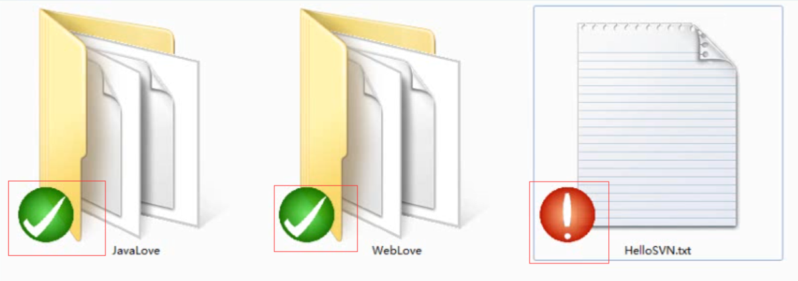
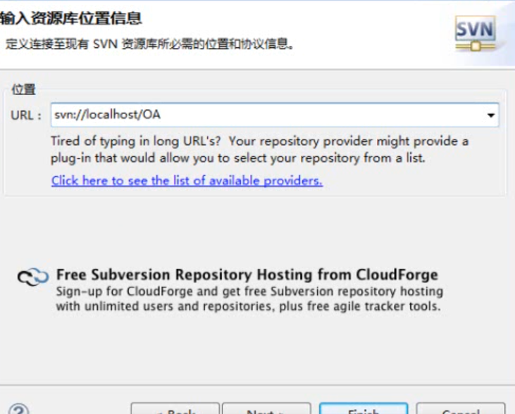

# SVN：版本控制器

## 1.实际需求：

​		1.1 代码备份

​		1.2 代码还原

​		1.3 协同修改

​		1.4 多版本项目管理

​		1.5 追溯问题代码的编写人和编写时间

​		1.5 权限控制

## 2.版本控制简介

### 		2.1 **版本控制**：

​			[Revision control]最初来源于工程设计领域，是维护工程蓝图的标准做法，能追踪工程蓝图从诞生一直到定案的过程。是一种记录若干文件内容变化，以便将来查阅特定版本修订情况的系统。

​		2.2 Subverision就是一款实现版本控制的工具软件，通常也称为版本控制器，简称**SVN**。Subverision是Apache软件基金会组织下的一个项目。

### 		2.3 **SVN**优良特性：

​				2.3.1 目录版本控制

​		Subverision实现了一个“虚拟”文件系统，可以追踪整个目录树的修改，文件和目录都是版本控制的，结果就是可以在客户端对文件和目录进行移动和复制命令。

​				2.3.2 原子提交

​		提交要么完全进入版本库，要么一点都没有，这允许开发者以一个逻辑块提交修改。

​				2.3.3 版本控制的元数据

​		每个文件和目录都有一组附加的”属性“，你可以发明和保存任意的键/值对，属性也会像文件一样被纳入版本控制。

​				2.3.4 可选的网络层

​		Subverision在版本库访问方面有一个抽象概念，利于人们去实现新的网络机制，Subverision的“高级”服务器是Apache网络服务器的一个模块，使用Http的变种协议WebDev/DetalV通讯，这给了Subverision在稳定性和交互性方面很大的好处，可以直接使用服务器的特性，例如认证、授权、传输压缩和版本可浏览等等。也有一个轻型的，单独运行的Subverision服务器，这个服务器使用自己的协议，可以轻松的用SSH封装。

​				2.3.5 一致的数据处理

​		Subverision 使用二进制文件差异算法展现文件的区别对于文本（人类可读）和二进制（人类不可读）文件具备一直的操作方式，两种类型的文件都存放在，差异在网络上双向传递。

​				2.3.6 高效的分支和标签

​		分支和标签的代价不与工程大小成比例，Subverisiom 简历分支和标签时只是在复制项目，使用了一种类似硬链接的机制，因而这类操作通常只会花费很少并且相对固定的时间，以及很小的版本库空间。

### 		 2.4 **SVN**的工作原理

​		采取客户端/服务器模式——在服务器的版本库中保存文件的各个版本，所有参与协同开发的程序员在自己本地电脑上保存一个工作副本，SVN支持程序员将本地副本更新到服务器端的最新版本，也支持将本地副本的最新改变更新到服务器端，而且后面的更新不会覆盖前面的更新，而是作为一个新的版本被保存下来——SVN甚至支持将本地工作副本恢复为服务器端保存的某一个历史版本。


​				 

### 				2.5 SVN基本操作

​		**检出[checkout]**:将一个服务器端创建好的项目整个下载到本地，这是到项目组参与开发的第一步，只需执行一次。

​		**更新[update]：**将本地文件更新为服务器端的最新版本，通每天上班时或修改公共文件之前执行一次。

​		**提交[commit]：**将本地修改内容修改到服务器端，通常下班时或实现一个功能、完成模块时执行一次。

## 3.Subverision的安装与配置

### 				3.1安装 服务器端程序（SubVerision）客户端程序（TortoiseSVN）

​		**服务器端程序版本**

​		官网推荐最稳定版本


​		**下载源码包**

​		[服务端官网下载地址](https://subversion.apache.org/download.cgi#recommended-release)

​		

​		[客户端官方下载地址](https://tortoisesvn.net/downloads.html)


​		中文语言包


​				**安装：**

​				SubVerision只能命令行操作。

​				TortoiseSVN不能命令行操作，右键菜单中操作，文件仓库文件会有提醒标识。安装方式可能发生变化，自行百度。


​				语言包安装完成，勾选下图选项，使用此语言包。


​				客户端操作，客户端仅是右键菜单中插件，没有单独界面。


​				文件上表示：



​			√标识与服务端同步，！标识有修改，需要提交。

### 3.2 服务器端配置

​			新建服务端仓库文件夹（所有项目根路径），在此所有仓库（即版本库）都放在AVNServiseRep目录下。


​			建立仓库文件夹，可有多个仓库，一个仓库下可有多个工程。这里建立OA、OB两个仓库。


​		**命令操作：**

​				建立SVN仓库，cmd命令cd 进入到仓库目录OA，执行下列命令：

```cmd
svnadmin create C:\SVNServiceRep\OA
```

​				会OA目录下创建一下文件：


​				conf：配置文件

​				db：数据库

​				hooks：额外程序，如每次提交给部门经理发邮件的程序。

​		**服务端启动：**

​				Subverision命令行启动：

​						svnservice -d -r C:\SVNServiceRep\OA

​						-d：后台执行 -r版本库目录，此处是C:\SVNServiceRep\OA(有conf、db等目录)。

​						启动完成后保留命令行窗口，关闭册停止服务。

​						新打开一个cmd命令行窗口

​						netstat -an 查看端口3690是否存在，存在服务正在运行。


​					命令行窗口关闭，服务停止，手动启动很麻烦。不推荐

​		**注册windows服务：**

​					将svn服务端程序注册为windows服务，随系统启动，自动启动。

​					注册windows服务需要XP、2000以上**系统自带工具**Service Control，执行文件为sc.exe，**需要管理员权限**。不是svn自带命令。

​					sc create SVNService（服务名） binpath= “SVN服务端安装目录\bin\svnservice.exe --service(以服务的方式启动) -r C:\SVNServiceRep” start= auto(随开机自启) depend= Tcpip

​				**注意：**等号左边无空格，右边有一个空格，windows规定。

​							-r ：版本库根目录，下面所有仓库服务都会启动,也可指定具体仓库，就只会启动一个仓库，多仓库，一般根目录。

​							可能会被安全软件拦截，统一即可。

​							windows服务中启动成功才表明，创建成功。

### 3.3 客户端

#### 		3.3.1 命令行

​				cd命令切换目录为本地代码存放目录

​				**检出**

​				svn checkout svn://localhost(服务端ip)/OA(仓库名)

​				svn:// SVN内部协议，自动寻找端口3690。

​				成功后会有隐藏文件.svn。不可删除、修改。存放服务端客户端交互信息。


​				**提交**

​				服务器开放权限，conf/svnservice.conf(全局配置)下设置。此处设置匿名权限改为writer，必须顶格。


​				

​				新建文件，需将文件纳入版本控制。

​				cd 进入文件所在目录

​				svn add HelloWorld.txt（文件名，tab键可自动补全）

​				svn commit -m “提交日志信息”  HelloWorld.txt      //-m “ ”日志信息 必须

​                **更新**

​				cd进入相应目录

​				svn update HelloWorld.txt  // 可不指定文件，不指定更新服务器对应目录下所有文件。

#### 		3.3.2 eclipse（可视化界面）版本差异，仅供参考。

​				安装SVN插件，亚索安装或者eclipse安装，自行百度，安装完重启。

​				eclipse 新建工程，分享到服务端。


​       		选择新建资源库，指定服务器端仓库地址：



创建好后会询问切换同步SVN服务器视图，右击文件，提交。想上传那个点那个。


​				其他人员开发：

​				检出：右击空白，import。选择SVN，检出项目。


​				设置SVN服务器位置。

​				svn://服务器IP/仓库名

​				某些不需要纳入版本控制的文件，添加忽略。如build文件


​			更新提交，右键team中。

​			文件夹说明：

 与服务器同步

有更新，需要提交

未纳入版本控制


​				仓库分析


#### 		3.3.3 IDEA（可视化界面）

​				IDEA自带。自行百度。

## 4.冲突、权限

​		**冲突：(eclipse解决)**

​		产生原因：

​				1.服务器文件更新，本地未更新，修改后提交。（故修改前，需要更新代码）

​                              更新以下代码：

​										

​                            解决：


​					编辑冲突，只能修改自己部分，然后标记为解决。如何修改，视情况而定。

​				**TortoiseSVN**解决冲突：


​			**权限：**

​			        服务器仓库，conf/svnservice.conf中

anon-access = none


​					conf/passwd中设置用户名密码：


​					权限分配：conf/authz中设置


## 5.时光机（代码还原，eclipseSVN客户端为例，IDEA自行百度）


​				打开某一个具体版本，如果合适，版本右击，获取内容，在这个版本基础上提交即可回到这个版本

