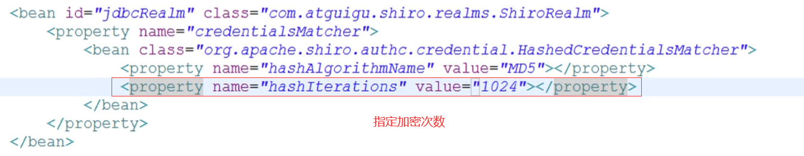
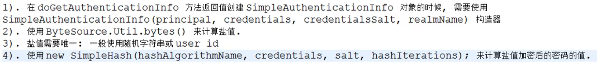

# Shiro 安全框架

## 1.Shiro简介

- Apache Shiro是java的一个安全（权限）框架

- Shiro的作用：认证、授权、加密、与web集成、缓存等

- [官方下载](http://shiro.apache.org/)

    

- 基本功能

    


- Shiro架构

    - 从外部看

        

        - Subject：应用代码与Shiro**直接交互的对象**，即Shiro对外的API核心为Subject。Subject代表当前“**用户**”，这个用户是指**与当前应用交互的任何东西**，都是Subject。如网络爬虫、机器人等。与Subject的所有交互都会委托给SecurityManager，**Subject其实是一个门面，SecurityManager才是实际执行者。**
        - SecurityManager：安全管理器，所有**安全有关的操作**都会与**SecurityManager**进行交互，且管理着所有的Subject，是**Shiro的核心**。相当于SpringMVC中的Dispatcherservlet。
        - Realm：**Shiro从Realm中获取安全数据（如用户、角色、权限）**。SecurityManager要验证用户身份、所属角色、是否有权限操作等，都必须从Realm中获取相关数据。

    - 从内部看

        

        - Subject：任何与用户交互的“用户”，应用程序代码与SecurityManager交互的门户。
        - SecurityManager：Shiro的心脏，管理者各大组件。管理者所有Subject，负责进行认证、授权、会话及缓存的管理。
        - Authenticator：**负责Subject认证**，是一个扩展点可以自定义实现；也可以使用认证策略（Authentication Strategy），即用户通过认证的条件设定。
        - Authorizer：授权器，及访问控制器。用来决定主体是否有权限进行相应操作，**控制着用户能访问应用中的哪些功能**。
        - SessionManager：**管理session生命周期的组件**。Shiro不仅仅用在web环境，也可以用在普通的javaSE环境。
        - CacheManager：**缓存控制器**，用来管理如用户、角色、权限等的缓存，这些数据基本上很少改变，放到缓存中可以提高访问性能。
        - Cryptography：**密码模块**，Shiro提供了一些常用的加密组件用于密码加密、解密。

## 2. HelloWorld 

以shiro快速入门为例了解Shiro。

[官方参考讲解](http://shiro.apache.org/10-minute-tutorial.html)


```java
//需结合配置文件（.ini）
//获取当前用户Subject
Subject currentUser = SecurityUtils.getSubject();
//通过当前用户获取session 调用Subject#getSession()方法
Session session = currentUser.getSession();
//Session#setAttribute方法设置属性和值，#getAttribute(“属性名”)，获取属性值
session.setAttribute( "someKey", "aValue" );
//当前用户是否登陆认证 调用Subject#isAuthenticated()
if ( !currentUser.isAuthenticated() ) {
    //未认证，将用户名和密码封装为UsernamePasswordToken对象
    UsernamePasswordToken token = new UsernamePasswordToken("lonestarr", "vespa");
    //是否记住登陆信息
    token.setRememberMe(true);
    //调用Subject#login(token)方法执行登陆
    currentUser.login(token);
}


//登陆异常捕获，由小到大
try {
    //执行登陆
    currentUser.login( token );
} catch ( UnknownAccountException uae ) {//用户名错误
} catch ( IncorrectCredentialsException ice ) {//密码错误
} catch ( LockedAccountException lae ) {//账户已锁定
}
    //... more types exceptions to check if you want ...
} catch ( AuthenticationException ae ) {//认证失败异常，上面三个异常的父类
}
//判断是否是某一角色，调用Subject#hasRole( "schwartz" )
if ( currentUser.hasRole( "schwartz" ) ) {
    log.info("May the Schwartz be with you!" );
} else {
    log.info( "Hello, mere mortal." );
}
//判断用户是否具有某一行为的权限，调用Subject#isPermitted( "lightsaber:weild" )方法，lightsaber类型weild实例的权限
if ( currentUser.isPermitted( "lightsaber:weild" ) ) {
    log.info("You may use a lightsaber ring.  Use it wisely.");
} else {
    log.info("Sorry, lightsaber rings are for schwartz masters only.");
}
//更具体的权限确认，判断是否有权限 winnebago类型的某一具体对象（eagle5）的某一行为（drive）
//user:delete:zhangsan 是否具有删除用户张三的权限
if ( currentUser.isPermitted( "winnebago:drive:eagle5" ) ) {
    log.info("You are permitted to 'drive' the 'winnebago' with license plate (id) 'eagle5'.  " +
                "Here are the keys - have fun!");
} else {
    log.info("Sorry, you aren't allowed to drive the 'eagle5' winnebago!");
}

//注销用户
currentUser.logout(); 
```


## 3.与spring整合（已过时略）

### 3.1 完成spring相关配置

### 3.2 shiro整合

- web.xml

    ```xml
    <listener>
        <listener-class>org.apache.shiro.web.env.EnvironmentLoaderListener</listener-class>
    </listener>
    
    <filter>
        <filter-name>ShiroFilter</filter-name>
        <filter-class>org.apache.shiro.web.servlet.ShiroFilter</filter-class>
    </filter>
    
    <filter-mapping>
        <filter-name>ShiroFilter</filter-name>
        <!-- 拦截所有请求，是否需要验证，spring-servlet.xml中配置 -->
        <url-pattern>/*</url-pattern>
        <dispatcher>REQUEST</dispatcher>
        <dispatcher>FORWARD</dispatcher>
        <dispatcher>INCLUDE</dispatcher>
        <dispatcher>ERROR</dispatcher>
    </filter-mapping>
    ```

- spring-servlet.xml（springMVC配置文件），配置shiro相关组件

    ```
    
    ```

    

    ### 3.3工作流程

     3.3.1 ShiroFilter：

    Shiro提供与Web集成的支持，其通过**ShiroFilter入口**来拦截需要安全控制的url，然后进行相应控制，类似于SpringNVC的前端控制器，是安全控制的入口点，负责**读取配置**（如.ini配置文件），判断URL是否需要**登陆/权限**等工作

    

    3.3.2 springMVC配置url权限细节：（urls部分配置）

    - 格式：url=参数  如果当前请求url匹配urls中某个url模式，将会执行其配置的过滤器。

        

    - 过滤器

        

        - anon（anonymous）表示拦截器支持匿名访问，即不需要登陆验证

        - authc（authentication）表示拦截器需要身份验证才能访问

    
        - authcBasic：Basic的身份验证过滤器，表示通过了url配置的资源会提示身份验证，例：“/welcom.jsp=authcBasic”访问welcom.jsp时会弹出身份验证框
    
    - perms：权限过滤器，表示访问通过了url配置的资源会检查相应权限，例：“/statics/**=perms["user:add:*,user:modify:*"]“表示访问statics目录下的资源时只有新增和修改的权限
    
        - port：端口过滤器，表示会验证通过了url配置的资源的请求的端口号，例：“/port.jsp=port[8088]”访问port.jsp时端口号不是8088会提示错误
    
        - rest：restful类型过滤器，表示会对通过了url配置的资源进行restful风格检查，例：“/welcom=rest[user:create]”表示通过restful访问welcom资源时只有新增权限
    
        - roles：角色过滤器，表示访问通过了url配置的资源会检查是否拥有该角色，例：“/welcom.jsp=roles[admin]”表示访问welcom.jsp页面时会检查是否拥有admin角色
    
        - ssl：ssl过滤器，表示通过了url配置的资源只能通过https协议访问，例：“/welcom.jsp=ssl”表示访问welcom.jsp页面如果请求协议不是https会提示错误
    
        - user：用户过滤器，表示可以使用登录验证/记住我的方式访问通过了url配置的资源，例：“/welcom.jsp=user”表示访问welcom.jsp页面可以通过登录验证或使用记住我后访问，否则直接跳转到登录
    
        - logout：退出拦截器，表示执行logout方法后，跳转到通过了url配置的资源，例：“/logout.jsp=logout”表示执行了logout方法后直接跳转到logout.jsp页面
    
    - 过滤器分类
    
        - 认证过滤器：anon、authcBasic、auchc、user、logout
    
            
    
        - 授权过滤器：perms、roles、ssl、rest、port
    
            
    
    - URL使用ant风格
    
        - "？"表示任一个字符，但不包括"/"。如“/admin?”能匹配""/admin1"，但不能匹配“/admin"、”/admin/"
        - “*”匹配零个或多个字符串，但不包括"/"。如“/admin(星)”匹配“/admin"、”/admin123",不能匹配“/admin/1"
        - ”**“匹配多个路径，如”/星星"，表示“/”下所有路径。
    
    - URL权限采用第一次匹配优先。即前面的权限可以覆盖后边的权限。

## 4.认证与加密

### 4.1认证思路


### 4.2 认证实现(自定义Realm的实现)


```java
//重写doGetAuthenticationInfo(AuthenticationToken)方法
//1.将AuthenticationToken强制转换为UsernamePasswordToken
UsernamePasswordToken upToken = (UsernamePasswordToken)token;//token为传入参数
//2.从UsernamePasswordToken中获取username
String username = upToken.getUsername();
//3.根据用户名查询数据库用户信息。

//4.根据查询结果抛出相应异常，如用户不存在，用户锁定

//5.根据用户情况，构建AuthenticationInfo对象并返回
	//从数据库获取的信息
	//1）principal,认证的实体信息，可以是username，也可以是数据表对应的实体类对象
Object principal = username;
	//2)credentials:密码
Object credentials = "数据库获取";
	//3)realmName:当前Realm对象的名称，通过getName()获取即可
String realmName = getName();
	//构建AuthenticationInfo对象
SimpleAuthenticationInfo info = new SimpleAuthenticationInfo(principal,credentials,realmName);//有多个构造方法，根据情况选择
return info;
```

配置Realm bean，添加到Spring容器中。

### 4.3 密码比对

源码：AuthenticationRealm的属性credentialsMatcher比对。


### 4.4密码的加密

**情况说明：**1.数据库中密码是加密后的密文，现需要将表单中传递过来的明文密码加密

方式：将AuthenticationRealm的属性credentialsMatcher替换为Md5credentialsMatcher


​			在springMVC配置文件中，将组件Realm的属性使用内部bean方式替换


还可以指定加密次数



**情况说明：**2.即使明文密码一样，加密后也要求不一样，提高安全性

故改用盐值加密：



### 4.5 多Realm认证

需求：多个数据库，加密方式可能不同，需要多个Realm

步骤：

- 自定义一个SecondRealm

- 配置bean，id为secondrealm。

    

- 配置认证器bean

    

- 将认证器添加到secutityManager的bean中。只有一个Realm，则直接将Realm放入secutityManager中

    

### 4.6 认证策略

AuthenticationStrategy接口默认实现：

- **FirstSuccessfulStrategy**：只要有一个Realm验证成功即可，**只返回第一个**Realm验证成功的认证信息，其他的忽略。

- **AtLeastOneSuccessfulStrategy**：只要有一个Realm验证成功即可，**但返回所有**验证成功的认证信息。

- **AllSuccessfulStrategy**：所有的Realm验证成功才算成功。且返回所有验证成功的认证信息，如果**有一个失败了就失败了**。

- ModelarRealmAuthenticator**默认是**AtLeastOneSuccessfulStrategy策略

    

    认证器，默认策略为**AtLeastOneSuccessfulStrategy**，可指定

## 5.授权

### 5.1 基本概念

- **授权**，也叫访问控制，即**在应用中控制谁可以访问那些资源**（如访问页面、编辑数据、页面操作等）。授权中的几个关键对象：主体（Subject）、资源（Resource）、权限（permission）、角色（Role）。

- **主体（Subject）**：访问应用的用户，在Shiro中使用 Subject 代表该用户。用户只有授权后才允许访问相应的资源。

- **资源（Resource）**：**在应用中用户可以访问的 URL** ，比如访问 JSP 页面、查看/编辑某些数据、访问某个业务方法、打印文件等都是资源。用户只有**授权后才能访问**。

- **权限（Permission）**：安全策略中的原子授权单位，通过权限我们可以表示，在应用中用户是否有操作某个资源的权利。即**权限表示用户是否能够访问应用中的某个资源**。权限代表了用户有没有操作某个资源的权利，反映在某个资源上的操作是否允许。

    

- Shiro支持粗粒度权限（如用户模块的所有权限）和细粒度权限（操作某个用户的权限，即实例级别）

    

- **角色（Role）**：**权限的集合**，一边情况下会赋予用户角色而不是权限，即这样的用户可以拥有一组权限，赋予权限时比较方便。

### 5.2 授权方式

- 编程式：if/else授权代码块。

    

- 注解式：通过在执行的Java方法上添加相应注解，没有权限会抛出相应异常。

    

- JSP/GSP 标签：相应标签

    

### 5.3 授权流程及实现

5.3.1 授权流程

5.3.2 授权的是实现

