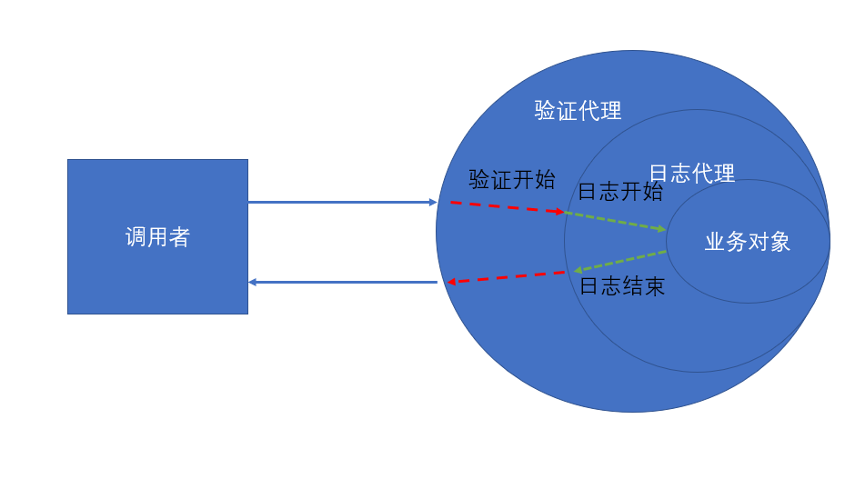
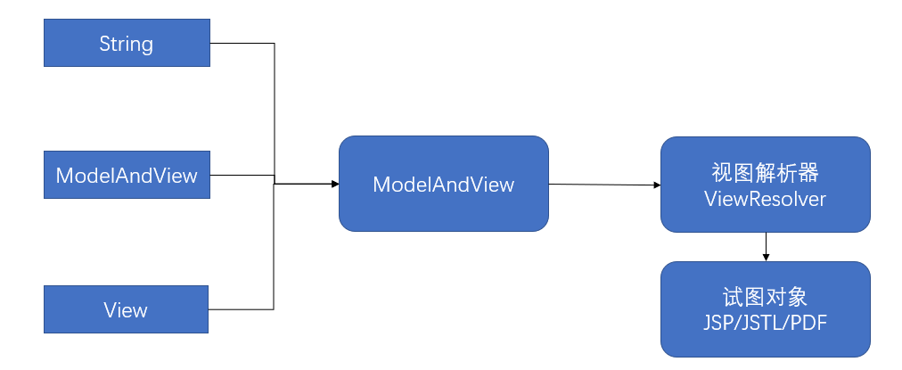
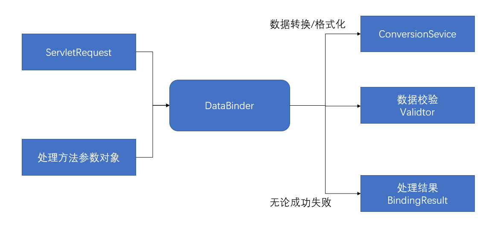
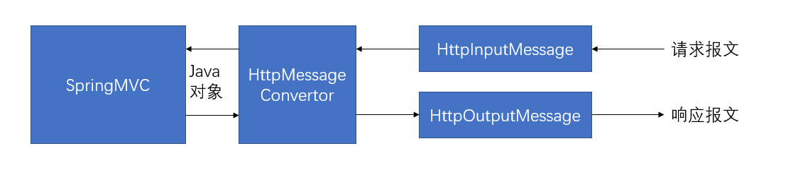

# SSM——Spring+SpringMVC+Mybatis

# Spring

[官方文档参考](https://docs.spring.io/spring/docs/5.2.7.RELEASE/spring-framework-reference/core.html#spring-core)

## 1.Spring 简介

- Spring 是一个开源框架
- Spring 为简化企业应用开发而生。Spring使用简单的JavaBean实现以前只有EJB才能实现的功能。
- Spring 是一个 DI（依赖注入）和 AOP（面向切面编程）容器框架
- Spring 特点 
    - 轻量级： Spring 是非侵入的，基于 Spring 开发的应用中的对象可以不依赖 Spring 的 API 。
    - 依赖注入  DI —— dependency injection
    - 面向切面编程 AOP —— aspect oriented programming
    - 容器 ：Spring 是一个容器，因为它包含并且管理应用对象的生命周期
    - 框架 ：Spring 实现了使用简单的组件配置组合成一个复杂的应用，在 Spring 可以使用 xml 和 Java 注解组合这些对象。
    - 战式： 在 IOC 和 AOP 的基础上可以整合各种企业应用的开源框架和优秀的第三方类库（Spring 自身提供了展现层的 SpringMVC 和持久层的 Spring JDBC ）。

## 2.Spring IOC 介绍

### 2.1 IOC 和 DI 概述

- IOC （Inversion of control）：思想是反转资源获取的方向。传统的资源查找方式要求组件像容器发出请求查找资源，作为回应，容器适时的返回资源。而 IOC 则是主动地将资源推送给他、它所管理的组件，组件所要做的仅是选择一种合适的方式来接受资源。这种行为也被成为查找的被动形式。
-  DI （dependency Injection）：IOC  的另一种表达方式：即组件的一些与定义好的方式（如：setter方法）来接受来自容器的资源注入。

### 2.2 Bean实例

- 配置形式： 

    - 基于 xml 文件

        ```xml
        <bean id="" class=""></bean>
        ```

        - 属性注入和构造器注入

            属性注入依赖 setter 方法，构造器注入依赖构造方法，多个构造器通过指明参数区分。

        - 自动装配（了解，不好用，不灵活，全属性注入，不方便）

            Spring IOC 容器可以自动装配，为bean中的 autowire 属性指定自动装配模式。

            - byType 根据类型自动装配：若IOC容器中存在多个与目标bean类型一致，Spring 将无法判定那个bean最适合该属性，故这种情况不能执行自动装配。
            - byName 根据名称自动装配：必须将目标bean 的名称和属性设置完全相同，才能生效。
            - constructorl 通过构造器自动装配：当bean 中存在多个构造器是，此种自动装配将会很复杂，不推荐使用。

    - 基于注解

        在 classpath 中扫描组建

        base-package 属性指定一个需要扫描的基类包，Spring 容器将会扫描这个基类包及其子包中的所有类。当需要扫描多个包时，可以使用逗号分隔。

        context:include-filter：包含目标类

        context:exclude-filter：排除目标类

        ```xml
        <context:component-scan
        		base-package="com.whmssmcrud" use-default-filters="false">
        		<!-- 只扫描控制器controller -->
        		<context:include-filter type="annotation"
        			expression="org.springframework.stereotype.Controller" />
        	</context:component-scan>
        ```

        Spring 能够从 classpath 下自动扫描，侦测和实例化具有特定注解的组件

        特定注解组件：

        - @component 标识了一个受 Spring 管理的组件。

        - @Respository 标识持久层组件

        - @Service 标识服务层组件（业务层）

        - @controller 标识表现层组件

            对于扫描到的组件 Spring 有默认的命名策略，使用非限定类名，第一个字母小写，也可以在注解上通过value属性值标识组件的名称。

        - 自动装配注解：

            - @Autowired
            - @Resource
            - @inject

- 配置方式：

    - 通过全类名反射
    - 静态工厂
        - 创建带静态工厂方法的类，编写静态方法
        - 在 xml 中配置相应的bean，注入 IOC 容器。
            - bean属性：factory-method，值：静态工厂方法名
            - 子标签 congstructor-ary，如果静态方法带参数，用该标签传参
    - 实例工厂方法
        - 创建工厂类，初始化一个工厂类实例，有实例对象调用工厂方法，返回bean。
        - 在 xml 中声明工厂的 bean。
    - FactoryBean 
        - 实现 FactoryBean接口，重写三个方法
        - 在 xml 中配置相应bean。

- bean 之间的关系：继承、依赖

    - 继承（与Java类的继承相似）

        - 子bean 中的parent属性指定父bean。
        - 子bean会继承父bean的属性配置，也可以覆盖从父bean 继承过来的配置。

    - 依赖

        - Spring 允许用户通过 depends-on 属性设置bean 的前置依赖bean，前置依赖的bean 会在本bean实例化之前创建好。

            如果前置依赖多个bean，则可以通过“逗号空格”的方式配置bean 的名称。

- bean 的作用域

    - scope属性设置bean 的作用域
        - singleton（默认值）：容器初始化创建bean 实例。在整个容器的生命周期只创建一个bean ，单例。
        - prototype（原型）：容器初始化不创建bean 的 实例，而是在每次请求都会创建一个新的bean 实例返回。

- 使用外部属性文件

    ```xml
    <context:property-placeholder
    		location="classpath:dbconfig.properties" />
    ```

- SPEL表达式

    - Spring 表达式语言（SPEL）：一个支持运行时查询和操作对象的强大表达式语言。
    - 作用：（为bean 属性的动态赋值提供便利）
        - 通过bean 的id 对bean 进行引用
        - 调用方法以及引用对象中的属性
        - 计算表达式的值
        - 正则表达式匹配
    - 语法：#｛***｝，SPEL使用“#｛｝”作为界定符，大括号内为表达式。

### 2.3 IOC 容器中bean 的生命周期

- Spring IOC 容器可以管理bean 的生命周期，Spring 允许在bean 的生命周期的特定点执行定制任务。

- 管理过程

    1. 通过构造器或者工厂方法等创建bean 实例
    2. 为bean实例的属性设置值和对其他bean 的引用
    3. 调用bean 的初始化方法。（bean的开始使用）
    4. 当容器关闭时，调用bean 的销毁方法。

    在bean 的声明中设置属性init-method和destroy-method，指定初始化方法和销毁方法。

- 创建bean 的后置处理器

    - bean 的后置处理器允许在调用初始化方法前后对bean进行额外处理。
    - bean 的后置处理器对IOC 容器里所有的bean 实例逐一处理，而非针对单一实例。典型应用：检查bean 属性的正确性或根据特定的标准更改bean 的属性。 
    - 对bean 的后置处理器而言，需要实现接口BeanPostProcessor ，在初始化方法被调用前后，Spring 将把每一个bean 实例分别传递给BeanPostProcessor 的PostProcessAfterInitializatio(object bean， String beanName)和PostProcessBeforeInitializatio(object bean， String beanName)
    - 含有后置处理器时的管理过程
        1. 通过构造器或者工厂方法等创建bean 实例
        2. 为bean实例的属性设置值和对其他bean 的引用
        3. 将bean 实例传递给bean 后置处理器的PostProcessBeforeInitializatio方法，完成调用。
        4. 调用bean 的初始化方法。调用后置处理器的PostProcessAfterInitializatio。（bean的开始使用）
        5. 当容器关闭时，调用bean 的销毁方法。

## 3.Spring AOP 面向切面编程

### 3.1 AOP原理

代理设计模式：使用一个代理对象将业务对象包装起来，然后用该代理对象取代原始对象。任何原始对象（业务部分）的调用都要通过代理，代理对象决定是否以及何时将方法调用转到原始对象上。



### 3.2 AOP 的作用（why？）

- 防止代码混乱：越来越多的业务需求（如日志、验证）加入后，原有业务急剧膨胀，每个方法在处理核心逻辑的同时还必须兼顾其他多个关注点。
- 防止代码分散：以日志需求为例，只是为了满足这个单一需求，就不得不在多个模块多次重复相同的日志代码，如果日志需求发生变化，就必须修改分散的所有模块。

### 3.3 AOP 简介

- AOP——Aspect Oriented Programming 面向切面编程：是一种新的方法论，是对传统的OOP——Object Oriented Programming 面向对象编程的补充。
- AOP 的主要编程对象是切面（Aspect），切面模块化横切关注点
- 在应用AOP 编程时，仍然需要公共功能，但可以明确定义这个功能在哪里，以什么方式应用，并不比修改影响的类。这样横切关注点就被模块化到特殊的对象（Aspect 切面）中。

### 3.4 AOP 优点

- 每个事物逻辑位于一个位置，代码不分散，便于维护升级。

- 业务模块更简洁，只包含核心业务代码

    

### 3.5 AOP 术语

- 切面 Aspect：横切关注点（跨应用程序多个模块的功能）被模块化的特殊对象
- 通知 advice：切面必须完成的工作
- 目标 target：被通知的对象
- 代理 Proxy：向目标对像应用通知之后创建的对象
- 连接点 JionPoint：程序执行的某个特定位置，如某个方法调用前、调用后、方法抛出异常后等，。连接点由两个信息确定：1）方法表示的程序执行点 2）相对点表示的方位
- 切点 PointCut：每个类都拥有多个连接点。连接点是程序类中客观存在的事物（业务方法）。AOP通过切点定位到特定的连接点。类比：连接点==数据库记录，切点==查询条件。一个切点可以匹配多个连接点。

### 3.6 Spring 中 AOP

AspectJ框架：Java社区中最完整最流行的AOP 框架。Spring2.0以上版本，可以使用基于AspectJ注解或基于xml配置的AOP

使用步骤：

- 导入相关maven依赖包

- 基于注解或xml方式使用

    - 注解方式

        - 在spring xml配置文件中添加标签

            ```xml
            <beans>
            <aop Schema></aop>
            <aop:aspectj-autoproxy></aop:aspectj-autoproxy>
            </beans>
            ```

        - IOC 容器会自动为AspectJ切面匹配的bean 创建代理

        声明切面类：在类上添加@Componnent、@Aspect注解。注解@Order(n)，n越小优先级越高，n为整数。

        类中各种方法注解：

        - @Before：前置通知，目标方法之前执行

        - @After：后置通知，目标方法之后执行，无论是否有异常都执行

        - @AfterRunning：返回通知，在目标方法返回结果之后执行

        - @Aft儿Throwing：异常通知，在方法抛出异常后执行

        - @Around：环绕通知，上述所有通知

            使用示例：

            ```java
            @Before("execution(save())")//save方法为被通知方法，不用带参数
            
            ```

            

    - xml配置方式

        - Spring还支持在bean 配置文件中声明切面，通过标签“aop schema”完成

        - 正常情况下，基于注解的声明要优于基于xml 的声明，基于AspectJ注解的切面可以与支持AspectJ注解的其他AOP 框架兼容，**基于xml 配置是Spring 专有**。

            ```xml
            <aop:config>
            		<!--切入表达式： 表示services包下的所有类所有方法都由事物切入管理（..表示有子包也一样*表示所有方法，括号中两点表示方法参数任意多） -->
            		<aop:pointcut
            			expression="execution(* com.whmssmcrud.Services..*(..))" id="txpoint" />
            		<aop:aspect><!--声明切面-->
                        <aop:after></aop:after><!--后置通知-->
                        <aop:before></aop:before><!--后置通知-->
                        。。。。
                	</aop:aspect>
            	</aop:config>
            ```

### 3.7 Spring 对JDBC 的支持 略

## 4.Spring事务管理

### 4.1 事务管理简介：

事务管理是企业级应用程序开发中必不可少的技术，用来确定数据完整性和数据一致性。

事务就是一系列动作，它们被当做一个单独的工作单元，这些动作要么全部完成，要么全都不执行。

事务的四个关键属性：

- 原子性 atomicity：事务就是一个原子操作，有一系列动作组成。事务的原子性确保动作要么全部完成，要么完全不执行。
- 一致性 consistency：一旦所有动作完成，事务就会被提交。数据和资源就处于一种满足业务规则的一致性状态中。
- 隔离性 isolution：可能许多事务会同时处理相同的数据，因此每个事物都应该与其它事务隔离开，防止数据损坏。
- 持久性 durability：一旦事务完成，无论发生什么系统错误，它的结果都不应该受到影响。通常情况下，事务的结果都被写到持久化存储器中。

### 4.2 Spring 中使用步骤：

基于注解

1. Spring 配置文件中配置DataSourceTransactionManager的bean。

    ```xml
    <!-- 事务管理器 -->
    	<bean id="TransactionManager"
    		class="org.springframework.jdbc.datasource.DataSourceTransactionManager">
    		<!-- 控制住数据源 -->
    		<property name="dataSource" ref="PooledDataSource"></property>
    	</bean>
    ```

2. 启用事务注解

    ```xml
    <tx:annotation-driven/>
    ```

    

3. 需要事务的地方加上事务注解@Transactional

    该注解下的方法中一系列操作要么都完成要么都不执行。

基于xml配置式的事务

1. Spring 配置文件中配置DataSourceTransactionManager的bean。

2. 配置事务属性

    ```xml
    <tx:advice id="txAdvice" transaction-manager="TransactionManager">
    		<tx:attributes>
    			<!--所有的方法都是事物方法 -->
    			<tx:method name="*" />
    			<!-- 以get开始的所有方法都是只读（调优） -->
    			<tx:method name="get*" read-only="true" />
    		</tx:attributes>
    </tx:advice>
    ```

3. 配置事务切入点

    ```xml
    <aop:config>
    		<!--切入表达式： 表示services包下的所有类所有方法都由事物切入管理（..表示有子包也一样*表示所有方法，括号中两点表示方法参数任意多） -->
    		<aop:pointcut
    			expression="execution(* com.whmssmcrud.Services..*(..))" id="txpoint" />
    		<!-- advice表示事物 ，point指切入点 -->
    		<aop:advisor advice-ref="txAdvice" pointcut-ref="txpoint" />
    </aop:config>
    ```

    

### 4.3 Spring 中事务的传播行为

 当事务的方法被另一事务调用时，必须指定事务的传播行为。

语法：@Transactional(propagation = Progatation.**REQUIRED**)

Spring 中7种事务的传播行为

1. REQUIRED 如果有事务在运行，当前方法就在自己的事务内运行，否则就启用一个新的事务，并在自己的事务内运行。
2. REQUIRED_NEW 当前方法必须启用新事务，并在它自己的事务内运行，如果有事务正在运行，应将它挂起。
3. SUPPORTS 如果有事务在运行，当前方法就在事务内运行，否则它可以不运行在事务中。
4. NOT_SUPPORTEI 当前方法不应该运行在事务中，如果有运行的事务则将它挂起。
5. MANDATORY 当前方法必须运行在事务内部，如果没有正在运行的事务，就抛出异常。
6. NEVER 当前方法不应该运行在事务中，如果有运行的事务就抛出异常。
7. NESTED 如果有事务在运行，当前方法就应该在这个事务的嵌套事务内运行，否则就启用一个新的事务，并在它自己的事务内运行。

### 4.4 并发事务可能导致的问题

当同一个应用程序或者不同应用程序中的多个事务在同一数据集上并发执行时，可能会出现许多意外问题

1. 脏读：对于两个事务T1、T2，T1读取了已经被T2更新但没有被提交的数据，之后若T2回滚，T1提交的数据就是临时的且无效的。
2. 不可重复读：对于两个事务T1、T2，T1读取了一个字段，然后T2更新了该字段，之后T1在独处统一字段，值就不同了。
3. 幻读：对于两个事务T1、T2，T1从表中读去了一个字段然后T2在表中插入了一些新的行。之后，如果T1再次读取该表，就会多出几行。

解决方案，指定事务隔离级别

语法：@Transactional(isolution = READ_COMMITED) 读已提交，最常用。

默认情况下Spring 的声明事务对所有事务进行回滚。也可以对对应属性设置，通常默认即可。

语法：@Transactional(Rollback=“”) 

设置属性 readonly=true，表示指定事务制度

设置属性timeout=n，指定事务超过n秒回滚。

# SpringMVC

[官方文档参考](https://docs.spring.io/spring/docs/5.2.7.RELEASE/spring-framework-reference/web.html#spring-web)

## 1. SpringMVC 概述

SpringMVC 是Spring 为展现层提供的基于MVC设计理念的优秀web框架，是目前最主流的MVC框架之一。

SpringMVC 通过一套MVC注解，让POJO成为处理请求的控制为，而无需实现任何接口。

SpringMVC支持Rest风格的URL请求

SpringMVC采用了松散耦合可插拔组件结构，比其它的MVC更具扩展性和灵活性。

使用步骤：

1. 导入相关maven依赖

2. 在web.xml文件中注册SpringMVC，并指定其配置文件位置，默认文件名为DispatcherServlet.xml 。

3. 在配置文件中设置常用配置，

    1. 规定扫包范围，

        ```xml
        <context:component-scan
        		base-package="com.whmssmcrud" use-default-filters="false">
        		<!-- 只扫描控制器controller -->
        		<context:include-filter type="annotation"
        			expression="org.springframework.stereotype.Controller" />
        	</context:component-scan>
        ```

    2. 配置试图解析器

        ```xml
        <bean
        		class="org.springframework.web.servlet.view.InternalResourceViewResolver">
        		<!-- 指定视图路径 -->
        		<property name="prefix" value="/WEB-INF/views/"></property>
        		<!-- 指定视图文件后缀 -->
        		<property name="suffix" value=".jsp"></property>
        	</bean>
        ```

    3. 两个常用配置

        ```xml
        <!-- 将SpringMVC不能处理的请求交给tomcat -->
        	<mvc:default-servlet-handler />
        	<!-- 支持springMVC更高级的东西，如JSR303校验，快捷AJAX...映射动态请求 -->
        	<mvc:annotation-driven />
        ```

        

## 2. 常用注解

- @Controller 放在前端控制器类上，表示该类为前段控制器。

- @RequestMapping 为控制器指定处理的url请求

    - 类上：初步映射url，相当于Web 根路径

    - 方法上：细分映射信息，若有类上初步映射，则相对于初步映射后的url。无初步映射，则该url 就相当于Web 跟路径。

    - 除了使用请求URL 映射请求外，还可以使用请求方法、请求参数、请求头映射请求。@RequestMapping的value、method、params、head属性，分别表示请求URL、请求方式、请求参数、请求头的映射请求条件，它们之间是“与”的关系，联合多个使用条件可以让请求映射更加精确化。

        params 和headers 支持简单表达式

        1. param1：表示请求必须包含名为param1的请求参数
        2.  !param1：表示请求不能包含名为param1的请求参数
        3. param1 != value1：包含param1的请求参数，但值不能为value1
        4. 多个参数可用“逗号”隔开，如：{"param1","param2"}

    - RequestMapping 支持通配符（ant风格资源地址格式）

        1. “?”：可匹配文件名中的一个字符
        2. “*”：可匹配文件名中的任意字符
        3. “**”：匹配多层路径

- @PathVariable 映射URL绑定的占位符。

    - 带占位符的URL是Spring 3.0 新增的功能，该功能在SpringMVC 像Rest目标挺进发展过程中具有里程碑意义。
    - 通过@PathVariable 可以将URL中占位符参数绑定到控制器处理方法的参数中，例：/app{id}，可以通过 “@PathVariable{"id"}  String id” 绑定到控制器方法参数中。

## 3. Rest风格请求

- REST（Representational State Transfer）：（资源）表现层状态转化，是目前最流行的一种互联网软件架构。它结构清晰、符合标准、易于理解、扩展方便，得到了越来越多网站的采用。

- 资源 Resources：网络上的一个实体，或者说是网络上的一个具体信息。可以用一个URI（同一资源定位符）指向的资源，每种资源对应一个特定的URI，通过这个独一无二的URI获取相应资源。

- 表现层（Representation）：把资源具体呈现出来的形式，叫做它的表现层。如html网页

- 状态转化（State Transfer）：每发出一个请求，就代表客户端和服务端的一次交互过程。HTTP协议是一个无状态协议，即所有的状态保存在服务端，因此客户端想要操作服务器，必须通过某种手段，让服务器端发生状态转化。而这种转化是建立在表现层之上的，所以就是“表现层状态转化”。具体来说就是：

    ​		HTTP协议中，四个表示操作方式的动词：GET、POST、PUT、DELETE。它们分别对应四种基本操作：GET表示获取资源、POST表示新建资源、PUT表示更新资源、DELETE表示删除资源。

- 使用步骤：在Web.xml中配置REST风格请求过滤器（HiddenHttpMethodFilter）。

    ```xml
    <!-- REST风格请求过滤器 -->
    	<filter>
    		<filter-name>HiddenHttpMethodFilter</filter-name>
    		<filter-class>org.springframework.web.filter.HiddenHttpMethodFilter</filter-class>
    	</filter>
    	<filter-mapping>
    		<filter-name>HiddenHttpMethodFilter</filter-name>
    		<url-pattern>/*</url-pattern>
    	</filter-mapping>
    ```


## 4. 映射请求&请求参数

- SpringMVC通过分析处理方法中的签名，将HTTP请求信息绑定到处理方法的相应参数中。
- SpringMVC对控制器处理方法签名的限制很宽松，几乎可以按喜欢的任何方式对方法进行签名。必要时可以对方法中的参数标注相应的注解（@PathVariable url路径中的值，@RequestParam 请求中的data，@RequestHeader 请求头中的值 等等），SpringMVC框架会将HTTP请求的信息绑定到相应的方法参数中，并根据方法的返回值类型做出相应后续处理。
- 常见注解：
    - **@RequestParam** 参数：**value**指定前端传入参数名，不设置需要求前端传入参数名与方法中参数名一致    **required**参数是否必须，默认为true **defaultValue**请求参数默认值
    - @RequestHeader 获取请求中Header中的值 参数同上
    - @CookieValue  获取请求中Header中的某个Cookie值
- SpringMVC会按请求请求参数名和后端POJO（bean中的实体类）属性名自动装配，自动装配该对象，填充属性值，并支持级联属性。
- Servlet原生API参数（需引入servlet-api jar包）
    - HttpServletRequest 
    - HttpServletResponse
    - HttpSession
    - java.security.Principal
    - Locale
    - InputStream
    - OutputStream
    - Reader
    - Writer

## 5. 处理模型数据

SpringMVC提供一下集中途径输出模型数据：

- ModelAndView：处理方法返回值类型为ModelAndView时，方法体即可通过该对象添加模型数据。

- Map、Model；参数为Model/Map/modelMap时，处理方法返回时，Map中的数据为自动添加到模型中。（页面取值：${requestScope.参数名}）

- @sessionsAttributes：将模型中的某个属性值暂时存放在HttpSession中，以便多个请求之间共享这个属性。

    @SessionAttributes(value={"",""},type={"",""})

    vaule：将属性名的值放入Session

    type：将某类型的值放入session

    页面取值：${SessionScope.属性名}

- @ModelAttributes：方法上标注该注解后，入参对象就会放到数据模型中。

## 6. 视图解析器



- 若项目中使用了JSTL，则SpringMVC会自动把视图由InternalResourceView转为JstlView。

- 若使用JSTL的父母贴标签需要在SpringMVC的配置文件中配置国际化资源文件。

    ```xml
    <bean id="" class="xxxResourceBundleMessageSource">
    	<property name="basename" value="i18n"></property><!--类路径下需有id8n.properies国际化配置资源文件-->
    </bean>
    ```

    

- 若希望直接相应通过SpringMVC渲染的页面，可以使用 mvc:view-controller 标签实现。

    ```xml
    <mvc:view-controller path="url地址" view-name="返回页面名"/>
    ```

    

- 自定义视图：（如excel）

    - 配置对应的视图解析器，BeanNameViewResolver
        - 属性order指定视图优先级，值越小，优先级越高。
    - 实现view接口，自定义相应视图。
    - 控制器中返会实现类的类名即可访问到相应自定义视图页面。

- 重定向

    - controller返回字符串带“forward”表示转发，格式“forward/index.jsp”。
    - controller返回字符串带“redirect”表示重定向，格式“redirect/index.jsp”。

## 7. 数据处理

### 7.1 数据转换

- Spring支持的转换器
    - Spring支持定义3种类型的转换器接口，实现任意一个转换器接口都可以作为自定义转换器，注册到配置文件的ConversionServiceFactoryBean中：
        - Converter(S,T) ：将S类型对象转换成T类型对象
        - ConverterFactory：将相同系列多个“同质”Converter封装在一起。如果希望将一种类型对象转换成另一类型对象及其子类对象，可使用ConverterFactory（转换器工厂）
        - GenericConverter：会根据源类对象及目标对象所在宿主类中的上下文信息进行类型转换。
- mvc:annotation-driven标签
    - 会自动注册RequestMappingHanderMapping、RequestMappingHanderAdapter与ExceptionHanderExceptionResolver三个bean。
    - 提供以下支持
        - 支持使用ConversionService实例对表单参数进行类型转换
        - 支持使用@NumberFormatannotation、@DateTimeFormat注解完成数据类型的格式化
        - 支持@Valid注解对JavaBean实例进行JSR303验证
        - 支持@RequestBody和@ResponseBody注解

### 7.2 数据绑定 @InitBinder

- 由@InitBinder表示的方法，可以对WebDataBinder对象进行初始化。WebDataBinder是DataBinder的子类，用于完成由表单字段到JavaBean属性的绑定。

- @InitBinder标注的方法不能有返回值，必须声明为void。

- @InitBinder标注的方法参数通常是WebDataBinder。

- SpringMVC通过反射机制对目标处理方法进行解析，江青求消息绑定到处理方法参数中。机制如下图所示

    

### 7.3 数据格式化（日期、时间、数值格式设置）

- 使用步骤

    - 配置

        ```xml
        <mvc:annotation-driven/>
        ```

        

    - 参数上加@DataTimeFormat(pattern="yyyy-mm-dd")、@NumberFormat(pattern="对数值的要求")。

- 配置FormattingConversionServiceFactoryBean既可用于类型转换，又可用于数据格式化，可取代ConversionFactoryBean。

### 7.4 数据校验——JSR303校验

- JSR303是JavaBean数据合法校验提供的标准框架，它已经包含在了Java EE 6.0中。

- JSR303通过在Bean属性上标注相应注解指定校验规则，并通过标准的验证接口对bean进行验证。

    注解表

    | Annotation                            | 属于Bean Validation 规范 | 应用位置                                                     | 作用                                                         | 对Hibernate Core中的元数据的影响                        |
    | ------------------------------------- | ------------------------ | ------------------------------------------------------------ | ------------------------------------------------------------ | ------------------------------------------------------- |
    | @AssertFalse                          | yes                      | field/property                                               | 检查被标注的值是否为false.                                   | 没有                                                    |
    | @AssertTrue                           | yes                      | field/property                                               | 检查被标注的值是否为true.                                    | 没有                                                    |
    | @CreditCardNumber                     | no                       | 字段或属性, 要求其类型为String.                              | 检查被标注的字符串能否通过Luhn Checksum test. 注意, 这个约束条件是为了防止用户手误, 并不对信用卡有效性进行检测. 请参考Anatomy of Credit Card Numbers. | 没有                                                    |
    | @DecimalMax                           | yes                      | 字段或属性. 支持类型包括BigDecimal, BigInteger, String, byte, short, int, long和其各自对应的包装器类型. | 被标注的值必须不大于约束中指定的最大值. 这个约束的参数是一个通过BigDecimal定义的最大值的字符串表示. | 没有                                                    |
    | @DecimalMin                           | yes                      | 字段或属性. 支持类型包括BigDecimal, BigInteger, String, byte, short, int, long和其各自对应的包装器类型. | 被标注的值必须不小于约束中指定的最小值. 这个约束的参数是一个通过BigDecimal定义的最小值的字符串表示. | 没有                                                    |
    | @Digits(integer=, fraction=)          | yes                      | 字段或属性. 支持类型包括BigDecimal, BigInteger, String, byte, short, int, long和其各自对应的包装器类型. | 检查此值是否是一个数字,并且这个数字的整数部分不超过integer定义的位数, 和小数部分不超过fraction 定义的位数. | 对应的数据库表字段会被设置精度(precision)和准度(scale). |
    | @Email                                | no                       | 字段或属性, 需要是String类型的.                              | 检查所给的字符串是否符合email地址的格式.                     | 没有                                                    |
    | @Future                               | yes                      | 字段或属性, 支持类型是java.util.Date 和 java.util.Calendar.  | 检查给定的日期是否比现在晚.                                  | 没有                                                    |
    | @Length(min=, max=)                   | no                       | 字段或属性, 需要是String类型的.                              | 检查该字符串的长度是否在min 和 max规定的范围内.              | 对应的数据库表字段的长度会被设置成约束中定义的最大值.   |
    | @Max                                  | yes                      | 字段或属性. 支持类型包括BigDecimal, BigInteger, String, byte, short, int, long和其各自对应的包装器类型. | 检查该值是否小于或等于约束条件中指定的最大值.                | 会给对应的数据库表字段添加一个check的约束条件.          |
    | @Min                                  | yes                      | 字段或属性. 支持类型包括BigDecimal, BigInteger, String, byte, short, int, long和其各自对应的包装器类型. | 检查该值是否大于或等于约束条件中规定的最小值.                | 会给对应的数据库表字段添加一个check的约束条件.          |
    | @NotNull                              | yes                      | field/property                                               | 检查该值不为null..                                           | 对应的表字段不允许为null.                               |
    | @NotBlank                             | no                       | field/property                                               | 检查该字符串不为null,并且不是空字符串. 本约束和下面的@NotEmpty的不同之处在于,本约束只能被用在字符串类型上,并且会忽略字符串尾部的空白字符. | 没有                                                    |
    | @NotEmpty                             | no                       | 字段或属性. 支持的类型包括String, Collection, Map 和数组.    | 检查该值不为null同时也不为空.                                | 没有                                                    |
    | @Null                                 | yes                      | field/property                                               | 检查该值应该为null.                                          | 没有                                                    |
    | @Past                                 | yes                      | 字段或属性, 支持类型是java.util.Date 和 java.util.Calendar.  | 检查标注对象中的值表示的日期比当前早.                        | 没有                                                    |
    | @Pattern(regex=, flag=)               | yes                      | 字段或属性, 需要是String类型的.                              | 检查该字符串是否能够在match指定的情况下被regex定义的正则表达式匹配. | 没有                                                    |
    | @Range(min=, max=)                    | no                       | 字段或属性. 支持类型包括BigDecimal, BigInteger, String, byte, short, int, long和其各自对应的包装器类型. | 检查该值是否在[min, max)之间                                 | 没有                                                    |
    | @Size(min=, max=)                     | yes                      | 字段或属性. 支持的类型包括String, Collection, Map 和数组.    | 检查该值的size是否在[min, max)之间.                          | 对应的数据库表字段的长度会被设置成约束中定义的最大值.   |
    | @ScriptAssert(lang=, script=, alias=) | no                       | 类                                                           | 要使用这个约束条件,必须先要保证Java Scripting API 即JSR 223 ("Scripting for the JavaTM Platform")的实现在类路径当中. 如果使用的时Java 6的话,则不是问题, 如果是老版本的话, 那么需要把 JSR 223的实现添加进类路径. 这个约束条件中的表达式可以使用任何兼容JSR 223的脚本来编写. (更多信息请参考javadoc) | 没有                                                    |
    | @URL(protocol=, host=, port=)         | no                       | 字段或属性, 要求其类型为String.                              | 判断该值是否是一个有效的URL, 如果给出了约束中的protocol, host 或 port 参数的话,那个被校验的值需要和其匹配. | 没有                                                    |
    | @Valid                                | yes                      | 字段或属性. 支持所有的非原始类型.                            | 递归的对关联对象进行校验, 如果关联对象是个集合或者数组, 那么对其中的元素进行递归校验,如果是一个map,则对其中的值部分进行校验. | 没有                                                    |

- Spring 4.0拥有自己独立的数据校验框架，同时支持JSR303标准的校验规则。

- Spring在进行数据绑定时，可同时调用校验框架完成数据校验工作。在SpringMVC中可直接通过注解驱动的方式进行数据校验。

- Spring的LocalValidatorFactoryBean既实现了Spring的Validator接口也实现了JSR303的Validator接口。只要在Spring容器中定义一个LocalValidatorFactoryBean，即可将其注入到需要数据校验的bean中。

- Spring本身并没有提供JSR303的实现，所以必须添加JSR303实现的jar（Hibernate Validator）包导入工程类路径下。

- 标签mvc:annotation-driven会默认装配好一个LocalValidtorFactoryBean，通过在处理方法参数上标注@Valid注解即可让SpringMVC完成数据校验工作。

    ```xml
    <mvc:annotation-driven/>
    ```

- 在已经标注了JSR303注解的表单/命令对象前标注一个@valid，SpringMVC框架在将请求参数绑定到该参数对象后，就会调用校验框架根据注解声明的校验规则来实施校验。

- SpringMVC是通过处理方法的签名规约来保存校验结果的，前一个表单/校验对象的校验结果保存到随后的参数中，这个保存校验结果的参数必须是BindResult或者Errors类型，这两个参数都位于org.springframework.validtor包中。

### 7.5 国际化

- 信息可以由浏览器语言决定显示的语言。

## 8. 返回JSON

-  导入相关jar包

- 返回JSON方法上标注@ResponseBody

- 原理图

    

- 文件上传

    - 导入相关jar包  

        ```xml
        <dependency>
        			<groupId>commons-fileupload</groupId>
        			<artifactId>commons-fileupload</artifactId>
        			<version>1.3.3</version>
        		</dependency>
        ```

        

    - 配置CommonsMultipartResolver （文件上传）的bean

        ```xml
        <bean id="multipartResolver" class="org.springframework.web.multipart.commons.CommonsMultipartResolver">
                <property name="maxUploadSize">
                	<value>52882190</value>
                </property>
                 <property name="maxInMemorySize" value="52882190" /><!--最大值，单位kb-->
                 <property name="defaultEncoding" value="utf-8"></property>
             </bean>
        ```

    - 使用MultipartFile对象获取上传文件。

## 9. 拦截器

- SpringMVC也可以使用拦截器对请求进行拦截处理，用户可以自定义拦截器来实现特定功能，自定义拦截器必须实现HanderInterceptor接口

    ```java
    /**
     * 登陆拦截器
     * @author whm
     * @date 2020年4月19日
     */
    public class LoginInterceptor implements HandlerInterceptor {
    
    	@Override
    	public boolean preHandle(HttpServletRequest request, HttpServletResponse response, Object handler)
    			throws Exception {
    		// TODO Auto-generated method stub
    	
    		//获取session
    		HttpSession session = request.getSession();
    		String userName = (String) session.getAttribute("userName");
    		if(userName!=null) {
    			return true;
    		}
    		//request.setAttribute("msg", "你还没有登录，请先登录！");
    		request.getRequestDispatcher("/tologin").forward(request, response);
    		return false;
    	}
    
    	@Override
    	public void postHandle(HttpServletRequest request, HttpServletResponse response, Object handler,
    			ModelAndView modelAndView) throws Exception {
    		// TODO Auto-generated method stub
    		HandlerInterceptor.super.postHandle(request, response, handler, modelAndView);
    	}
    
    	@Override
    	public void afterCompletion(HttpServletRequest request, HttpServletResponse response, Object handler, Exception ex)
    			throws Exception {
    		// TODO Auto-generated method stub
    		HandlerInterceptor.super.afterCompletion(request, response, handler, ex);
    	}
    
    	
    }
    ```

    - preHandle：这方法在业务处理器处理请求之前被调用，在该方法中对用户request进行处理。如果程序员该拦截器对请求进行拦截处理后，还要调用其它的拦截器或者是业务处理器去进行处理，则返回true；否则返回false；

    - postHandle：这方法在业务处理器处理完请求后，在DispatcherServlet向客户端返回响应之前被调用，在该方法中对用户请求request进行处理。

    - afterCompletion：这个方法在DispatcherServlet完全处理请求后被调用。可以在方法中进行一些资源清理操作。

    - 拦截器注入容器（bean）

        ```xml
        <mvc:interceptors>
        	 	<mvc:interceptor>
        	 		<mvc:mapping path="/**"/><!--拦截所有请求：要拦截的请求放前面，不然拦截不到可能-->
        	 		<mvc:exclude-mapping path="/index.jsp"/><!--不拦截的请求-->
        	 		<mvc:exclude-mapping path="/tohealthKeeping"/>
        	 		<bean class="com.whm.ZXCYWZ.utils.LoginInterceptor" />
        	 	</mvc:interceptor>
        	 </mvc:interceptors>
        ```

    - 多个拦截器执行顺序：

        preHandle(1)...preHandle(2)...                （顺序）

        postHandle(2)...postHandle(1)...               （倒序）

        afterCompletion(2)...afterCompletion(1)   （倒序）

## 10. 异常处理

- SpringMVC 通过HandlerExceptionResolver处理程序异常，包括Handler映射，数据绑定以及目标方法执行时的异常。

- 三个重要的实现类（使用时需要添加 “mvc;annotation-driven” 配置）：

    - ExcptionHandlerExceptionResolver（id=140）

        - 主要处理Handler中用@ExceptionHandler标注的方法
        - 优先级：
            - 根据异常最近继承 关系找到继承深度最浅的那个@ExceptionHandler标注的方法，及标记了RuntimerException的方法。
            - ExcptionHandlerExceptionResolver内部若是找不到ExceptionHandler标注的方法，会找@ControllerAdvice（自定义注解异常类）中的@ExceptionHandler标注的方法。

    - ResponseStatusExceptionResolver（id=143）

        - ```java
            @ResponseStatus(value=HttpStatus.ok,reason="状态信息")
            ```

            自定义错误类型和状态信息。

    - DefaultHandlerExceptionResolver（id=146）（用于处理特定异常）

    - SimpleMaappingExceptionResolver 

        - 将异常类名映射为视图名，即发生异常是使用对应视图报告异常（如404,405异常）

        - 配置bean（注入容器）

            ```xml
            <bean id="simpleMappingExceptionResolver" class="org.springframework.web.servlet.handler.SimpleMappingExceptionResolver">
            	 	<property name="ExceptionMapping">
            	 		<props>
            	 			<prop key="异常全类名">视图名</prop>
            	 		</props>
            	 	</property>
            	 </bean>
            ```

            

## 11. SpringMVC 运行流程


SpringMVC和Spring配置文件为什么分开配置（Spring整合SpringMVC）？

1. 通常，类似于数据源，事务，整合其它框架都是放在Spring配置文件中，实际上放入Spring配置文件对应的IOC容器中还有Service和DAO接口层。
2. 都放在SpringMVC配置文件中可以，也可以分多个Spring的配置文件，然后使用import节点导入其它的配置文件。
3. 推荐：分开配置吗SpringMVC中只放Handler。

# MyBatis

[官方文档参考](https://mybatis.org/mybatis-3/zh/getting-started.html)

## 1. 概述

- 背景：Hibernate是全自动映射ORM（Object Relation Mapping）框架，旨在消除sql，提供HQL修改定制sql。  全自动、全映射——>自由度不够无法优化

    希望：sql语句交给开发人员编写，希望sql不失去灵活性

    MyBatis诞生

- MyBatis是半自动的、轻量级的框架。它将sql语句的编写以xml配置文件的形式提取出来，达到sql与Java编码分离，sql交由开发人员控制。

### 1.1 使用步骤

1. 在Java Web工程中导入MyBatis的jar包
2. 创建全局配置文件
3. 创建sql映射文件：配置每一个sql以及sql的封装规则等
4. 将sql映射文件注册到全局配置文件中
5. 两种调用方式
    1. 原生
        1. 根据全局配置文件，创建SqlSessionFactory对象
        2. 使用SqlSessionFactory对象获取SqlSession对象，通过Sqlsession对象执行失sql操作。一个SqlSession代表一次和数据库交互的会话，用完必须关闭。
        3. 使用sql的唯一表示（id）来指明执行哪一个sql语句。
    2. 接口式编程（借口类与sql映射文件动态绑定）
        1. 有全局配置文件创建SqlSessionFactory对象
        2. 使用SqlSessionFactory对象获取SqlSession对象
        3. 获取sql映射文件对应接口实现类对象，MyBatis会自动为接口创建一个代理对象，通过代理对象去执行sql映射文件中的sql语句。
        4. 使用完关闭回话。
6. 小结：
    - sqlSession代表和数据库的一次会话，用完必须关闭。
    - SqlSession和connection一样是非线程安全，为避免资源占用，每次使用都应该去获取新的对象。
    - Mapper接口没有实现类，但是MyBatis会为这个接口生成一个代理对象。
    - 全局配置文件和sql映射文件
        - Mybatis的全局配置文件包含数据库连接池信息、事务管理、系统运行环境信息。。。
        - sql映射文件：保存了每一sql语句的映射信息。

## 2. 全局配置文件设置

全局配置文件配置：

- MyBatis可以使用“properties”标签来引入外部配置文件。

    ```xml
    <properties resource="org/mybatis/example/config.properties">
      <property name="username" value="dev_user"/>
      <property name="password" value="F2Fa3!33TYyg"/>
    </properties>
    ```

    resource：引入类路径下资源文件

    rel：引入网络/磁盘路径下的文件

- settings 设置项

    ```xml
    <settings>
      <setting name="cacheEnabled" value="true"/>
      <setting name="lazyLoadingEnabled" value="true"/>
      <setting name="multipleResultSetsEnabled" value="true"/>
      <setting name="useColumnLabel" value="true"/>
      <setting name="useGeneratedKeys" value="false"/>
      <setting name="autoMappingBehavior" value="PARTIAL"/>
      <setting name="autoMappingUnknownColumnBehavior" value="WARNING"/>
      <setting name="defaultExecutorType" value="SIMPLE"/>
      <setting name="defaultStatementTimeout" value="25"/>
      <setting name="defaultFetchSize" value="100"/>
      <setting name="safeRowBoundsEnabled" value="false"/>
      <setting name="mapUnderscoreToCamelCase" value="false"/>
      <setting name="localCacheScope" value="SESSION"/>
      <setting name="jdbcTypeForNull" value="OTHER"/>
      <setting name="lazyLoadTriggerMethods" value="equals,clone,hashCode,toString"/>
    </settings>
    ```

    设置项：

    | 设置名                           | 描述                                                         | 有效值                                                       | 默认值                                                |
    | :------------------------------- | :----------------------------------------------------------- | :----------------------------------------------------------- | :---------------------------------------------------- |
    | cacheEnabled                     | 全局性地开启或关闭所有映射器配置文件中已配置的任何缓存。     | true \| false                                                | true                                                  |
    | lazyLoadingEnabled               | 延迟加载的全局开关。当开启时，所有关联对象都会延迟加载。 特定关联关系中可通过设置 `fetchType` 属性来覆盖该项的开关状态。 | true \| false                                                | false                                                 |
    | aggressiveLazyLoading            | 开启时，任一方法的调用都会加载该对象的所有延迟加载属性。 否则，每个延迟加载属性会按需加载（参考 `lazyLoadTriggerMethods`)。 | true \| false                                                | false （在 3.4.1 及之前的版本中默认为 true）          |
    | multipleResultSetsEnabled        | 是否允许单个语句返回多结果集（需要数据库驱动支持）。         | true \| false                                                | true                                                  |
    | useColumnLabel                   | 使用列标签代替列名。实际表现依赖于数据库驱动，具体可参考数据库驱动的相关文档，或通过对比测试来观察。 | true \| false                                                | true                                                  |
    | useGeneratedKeys                 | 允许 JDBC 支持自动生成主键，需要数据库驱动支持。如果设置为 true，将强制使用自动生成主键。尽管一些数据库驱动不支持此特性，但仍可正常工作（如 Derby）。 | true \| false                                                | False                                                 |
    | autoMappingBehavior              | 指定 MyBatis 应如何自动映射列到字段或属性。 NONE 表示关闭自动映射；PARTIAL 只会自动映射没有定义嵌套结果映射的字段。 FULL 会自动映射任何复杂的结果集（无论是否嵌套）。 | NONE, PARTIAL, FULL                                          | PARTIAL                                               |
    | autoMappingUnknownColumnBehavior | 指定发现自动映射目标未知列（或未知属性类型）的行为。`NONE`: 不做任何反应`WARNING`: 输出警告日志（`'org.apache.ibatis.session.AutoMappingUnknownColumnBehavior'` 的日志等级必须设置为 `WARN`）`FAILING`: 映射失败 (抛出 `SqlSessionException`) | NONE, WARNING, FAILING                                       | NONE                                                  |
    | defaultExecutorType              | 配置默认的执行器。SIMPLE 就是普通的执行器；REUSE 执行器会重用预处理语句（PreparedStatement）； BATCH 执行器不仅重用语句还会执行批量更新。 | SIMPLE REUSE BATCH                                           | SIMPLE                                                |
    | defaultStatementTimeout          | 设置超时时间，它决定数据库驱动等待数据库响应的秒数。         | 任意正整数                                                   | 未设置 (null)                                         |
    | defaultFetchSize                 | 为驱动的结果集获取数量（fetchSize）设置一个建议值。此参数只可以在查询设置中被覆盖。 | 任意正整数                                                   | 未设置 (null)                                         |
    | defaultResultSetType             | 指定语句默认的滚动策略。（新增于 3.5.2）                     | FORWARD_ONLY \| SCROLL_SENSITIVE \| SCROLL_INSENSITIVE \| DEFAULT（等同于未设置） | 未设置 (null)                                         |
    | safeRowBoundsEnabled             | 是否允许在嵌套语句中使用分页（RowBounds）。如果允许使用则设置为 false。 | true \| false                                                | False                                                 |
    | safeResultHandlerEnabled         | 是否允许在嵌套语句中使用结果处理器（ResultHandler）。如果允许使用则设置为 false。 | true \| false                                                | True                                                  |
    | mapUnderscoreToCamelCase         | 是否开启驼峰命名自动映射，即从经典数据库列名 A_COLUMN 映射到经典 Java 属性名 aColumn。 | true \| false                                                | False                                                 |
    | localCacheScope                  | MyBatis 利用本地缓存机制（Local Cache）防止循环引用和加速重复的嵌套查询。 默认值为 SESSION，会缓存一个会话中执行的所有查询。 若设置值为 STATEMENT，本地缓存将仅用于执行语句，对相同 SqlSession 的不同查询将不会进行缓存。 | SESSION \| STATEMENT                                         | SESSION                                               |
    | jdbcTypeForNull                  | 当没有为参数指定特定的 JDBC 类型时，空值的默认 JDBC 类型。 某些数据库驱动需要指定列的 JDBC 类型，多数情况直接用一般类型即可，比如 NULL、VARCHAR 或 OTHER。 | JdbcType 常量，常用值：NULL、VARCHAR 或 OTHER。              | OTHER                                                 |
    | lazyLoadTriggerMethods           | 指定对象的哪些方法触发一次延迟加载。                         | 用逗号分隔的方法列表。                                       | equals,clone,hashCode,toString                        |
    | defaultScriptingLanguage         | 指定动态 SQL 生成使用的默认脚本语言。                        | 一个类型别名或全限定类名。                                   | org.apache.ibatis.scripting.xmltags.XMLLanguageDriver |
    | defaultEnumTypeHandler           | 指定 Enum 使用的默认 `TypeHandler` 。（新增于 3.4.5）        | 一个类型别名或全限定类名。                                   | org.apache.ibatis.type.EnumTypeHandler                |
    | callSettersOnNulls               | 指定当结果集中值为 null 的时候是否调用映射对象的 setter（map 对象时为 put）方法，这在依赖于 Map.keySet() 或 null 值进行初始化时比较有用。注意基本类型（int、boolean 等）是不能设置成 null 的。 | true \| false                                                | false                                                 |
    | returnInstanceForEmptyRow        | 当返回行的所有列都是空时，MyBatis默认返回 `null`。 当开启这个设置时，MyBatis会返回一个空实例。 请注意，它也适用于嵌套的结果集（如集合或关联）。（新增于 3.4.2） | true \| false                                                | false                                                 |
    | logPrefix                        | 指定 MyBatis 增加到日志名称的前缀。                          | 任何字符串                                                   | 未设置                                                |
    | logImpl                          | 指定 MyBatis 所用日志的具体实现，未指定时将自动查找。        | SLF4J \| LOG4J \| LOG4J2 \| JDK_LOGGING \| COMMONS_LOGGING \| STDOUT_LOGGING \| NO_LOGGING | 未设置                                                |
    | proxyFactory                     | 指定 Mybatis 创建可延迟加载对象所用到的代理工具。            | CGLIB \| JAVASSIST                                           | JAVASSIST （MyBatis 3.3 以上）                        |
    | vfsImpl                          | 指定 VFS 的实现                                              | 自定义 VFS 的实现的类全限定名，以逗号分隔。                  | 未设置                                                |
    | useActualParamName               | 允许使用方法签名中的名称作为语句参数名称。 为了使用该特性，你的项目必须采用 Java 8 编译，并且加上 `-parameters` 选项。（新增于 3.4.1） | true \| false                                                | true                                                  |
    | configurationFactory             | 指定一个提供 `Configuration` 实例的类。 这个被返回的 Configuration 实例用来加载被反序列化对象的延迟加载属性值。 这个类必须包含一个签名为`static Configuration getConfiguration()` 的方法。（新增于 3.2.3） | 一个类型别名或完全限定类名。                                 | 未设置                                                |
    | shrinkWhitespacesInSql           | Removes extra whitespace characters from the SQL. Note that this also affects literal strings in SQL. (Since 3.5.5) | true \| false                                                | false                                                 |

- 类型别名（typeAliases）

    类型别名可为 Java 类型设置一个缩写名字。 它仅用于 XML 配置，意在降低冗余的全限定类名书写

    ```xml
    <typeAliases>
      <typeAlias alias="Author" type="domain.blog.Author"/>
      <typeAlias alias="Blog" type="domain.blog.Blog"/>
      <typeAlias alias="Comment" type="domain.blog.Comment"/>
      <typeAlias alias="Post" type="domain.blog.Post"/>
      <typeAlias alias="Section" type="domain.blog.Section"/>
      <typeAlias alias="Tag" type="domain.blog.Tag"/>
    </typeAliases>
    ```

- 类型处理器（typeHandlers）

    MyBatis 在设置预处理语句（PreparedStatement）中的参数或从结果集中取出一个值时， 都会用类型处理器将获取到的值以合适的方式转换成 Java 类型。从 3.4.5 开始，MyBatis 默认支持 JSR-310（日期和时间 API） 。

- 环境配置（environments）

    MyBatis 可以配置成适应多种环境，这种机制有助于将 SQL 映射应用于多种数据库之中， 现实情况下有多种理由需要这么做。

    ```xml
    <environments default="development">
      <environment id="development">
        <transactionManager type="JDBC">
          <property name="..." value="..."/>
        </transactionManager>
        <dataSource type="POOLED">
          <property name="driver" value="${driver}"/>
          <property name="url" value="${url}"/>
          <property name="username" value="${username}"/>
          <property name="password" value="${password}"/>
        </dataSource>
      </environment>
    </environments>
    
    <!--数据源配置-->
    <dataSource type="org.myproject.C3P0DataSourceFactory">
      <property name="driver" value="org.postgresql.Driver"/>
      <property name="url" value="jdbc:postgresql:mydb"/>
      <property name="username" value="postgres"/>
      <property name="password" value="root"/>
    </dataSource>
    
    ```

- 数据库厂商标识（databaseIdProvider）

    MyBatis 可以根据不同的数据库厂商执行不同的语句，这种多厂商的支持是基于映射语句中的 `databaseId` 属性。

    ```xml
    <databaseIdProvider type="DB_VENDOR">
      <property name="SQL Server" value="sqlserver"/>
      <property name="DB2" value="db2"/>
      <property name="Oracle" value="oracle" />
    </databaseIdProvider>
    ```

- 映射器（mappers）

    告诉 MyBatis 到哪里去找映射文件。 

    ```xml
    <!-- 使用相对于类路径的资源引用 -->
    <mappers>
      <mapper resource="org/mybatis/builder/AuthorMapper.xml"/>
      <mapper resource="org/mybatis/builder/BlogMapper.xml"/>
      <mapper resource="org/mybatis/builder/PostMapper.xml"/>
    </mappers>
    <!-- 使用完全限定资源定位符（URL） -->
    <mappers>
      <mapper url="file:///var/mappers/AuthorMapper.xml"/>
      <mapper url="file:///var/mappers/BlogMapper.xml"/>
      <mapper url="file:///var/mappers/PostMapper.xml"/>
    </mappers>
    <!-- 使用映射器接口实现类的完全限定类名 -->
    <mappers>
      <mapper class="org.mybatis.builder.AuthorMapper"/>
      <mapper class="org.mybatis.builder.BlogMapper"/>
      <mapper class="org.mybatis.builder.PostMapper"/>
    </mappers>
    <!-- 将包内的映射器接口实现全部注册为映射器 -->
    <mappers>
      <package name="org.mybatis.builder"/>
    </mappers>
    ```

## 3. SQL映射文件

- 增删改查 SQL

    [查看官方文档](https://mybatis.org/mybatis-3/zh/sqlmap-xml.html)

- 参数处理


。。。。。都可查阅参考文献。