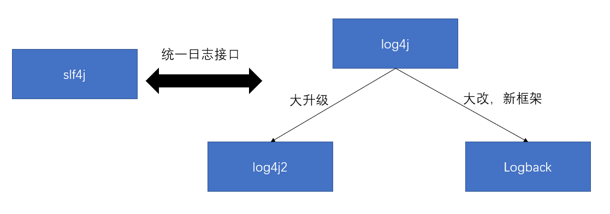
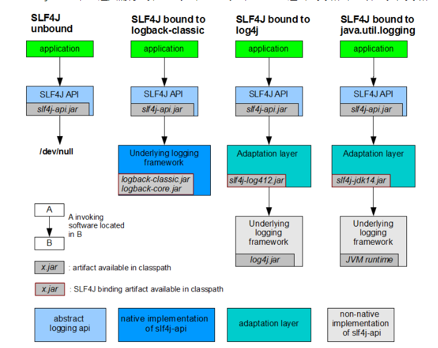
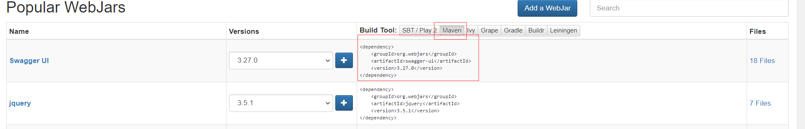

# SpringBoot

## SpringBoot基础篇

[SpringBoot官方参考文档](https://docs.spring.io/spring-boot/docs/2.3.1.RELEASE/reference/html/)

SpringBoot用来简化Spring应用开发，约定大于配置，去繁从简，just run就能创建一个独立的产品级别的应用。

优点：

- 快速创建独立运行的Spring项目以及主流框架的集成。
- 使用嵌入式的Servlet容器，应用无需打成war包
- starters自动依赖与版本控制
- 大量的自动配置，简化开发，也可修改默认值
- 无需繁杂的xml配置，无代码生成，开箱即用
- 准生产环境的运行时应用监控
- 与云计算的天然集成

### 1. 概述

- Spring是简化Spring应用开发的一个框架；整个Spring技术栈的一个大整合；J2EE的一站式解决方案。

- 微服务（了解）

    - 微服务即服务微化（架构风格）。
    - 一个应用应该是一组小型服务，可以通过HTTP协议进行互通；每一个功能元素最终都是一个独立替换和独立升级的软件单元。

- 入门

    1. 创建Maven工程
    2. 引入starters
    3. 创建主程序
    4. 启动运行

- spring-boot-starter：SpringBoot场景启动器

    - SpringBoot将所有的功能场景都抽取出来，做成一个个starters（启动器），只需在项目中引入这些starter相关场景的所有依赖都会导入进来。

        | 名称                                          | 描述                                                         |
        | :-------------------------------------------- | :----------------------------------------------------------- |
        | `spring-boot-starter`                         | 核心入门工具，包括自动配置支持，日志记录和YAML               |
        | `spring-boot-starter-activemq`                | 使用Apache ActiveMQ的JMS消息传递入门                         |
        | `spring-boot-starter-amqp`                    | 使用Spring AMQP和Rabbit MQ的入门                             |
        | `spring-boot-starter-aop`                     | 使用Spring AOP和AspectJ进行面向方面编程的入门                |
        | `spring-boot-starter-artemis`                 | 使用Apache Artemis的JMS消息传递入门                          |
        | `spring-boot-starter-batch`                   | 使用Spring Batch的入门                                       |
        | `spring-boot-starter-cache`                   | 开始使用Spring Framework的缓存支持                           |
        | `spring-boot-starter-data-cassandra`          | 使用Cassandra分布式数据库和Spring Data Cassandra的入门       |
        | `spring-boot-starter-data-cassandra-reactive` | 使用Cassandra分布式数据库和Spring Data Cassandra Reactive的入门 |
        | `spring-boot-starter-data-couchbase`          | 使用Couchbase面向文档的数据库和Spring Data Couchbase的入门   |
        | `spring-boot-starter-data-couchbase-reactive` | 使用Couchbase面向文档的数据库和Spring Data Couchbase Reactive的入门 |
        | `spring-boot-starter-data-elasticsearch`      | 使用Elasticsearch搜索和分析引擎以及Spring Data Elasticsearch的入门者 |
        | `spring-boot-starter-data-jdbc`               | 使用Spring Data JDBC的入门                                   |
        | `spring-boot-starter-data-jpa`                | 将Spring Data JPA与Hibernate结合使用的入门                   |
        | `spring-boot-starter-data-ldap`               | 使用Spring Data LDAP的入门                                   |
        | `spring-boot-starter-data-mongodb`            | 使用MongoDB面向文档的数据库和Spring Data MongoDB的入门       |
        | `spring-boot-starter-data-mongodb-reactive`   | 使用MongoDB面向文档的数据库和Spring Data MongoDB Reactive的入门 |
        | `spring-boot-starter-data-neo4j`              | 使用Neo4j图形数据库和Spring Data Neo4j的入门程序             |
        | `spring-boot-starter-data-r2dbc`              | 使用Spring Data R2DBC的入门                                  |
        | `spring-boot-starter-data-redis`              | 使用Redis键值数据存储与Spring Data Redis和Lettuce客户端的入门 |
        | `spring-boot-starter-data-redis-reactive`     | 将Redis键值数据存储与Spring Data Redis Reacting和Lettuce客户端一起使用的入门 |
        | `spring-boot-starter-data-rest`               | 使用Spring Data REST在REST上公开Spring数据存储库的入门       |
        | `spring-boot-starter-data-solr`               | 将Apache Solr搜索平台与Spring Data Solr结合使用的入门        |
        | `spring-boot-starter-freemarker`              | 使用FreeMarker视图构建MVC Web应用程序的入门                  |
        | `spring-boot-starter-groovy-templates`        | 使用Groovy模板视图构建MVC Web应用程序的入门                  |
        | `spring-boot-starter-hateoas`                 | 使用Spring MVC和Spring HATEOAS构建基于超媒体的RESTful Web应用程序的入门者 |
        | `spring-boot-starter-integration`             | 使用Spring Integration的入门                                 |
        | `spring-boot-starter-jdbc`                    | 结合使用JDBC和HikariCP连接池的入门                           |
        | `spring-boot-starter-jersey`                  | 使用JAX-RS和Jersey构建RESTful Web应用程序的入门。的替代品[`spring-boot-starter-web`](https://docs.spring.io/spring-boot/docs/2.3.1.RELEASE/reference/html/using-spring-boot.html#spring-boot-starter-web) |
        | `spring-boot-starter-jooq`                    | 使用jOOQ访问SQL数据库的入门。替代[`spring-boot-starter-data-jpa`](https://docs.spring.io/spring-boot/docs/2.3.1.RELEASE/reference/html/using-spring-boot.html#spring-boot-starter-data-jpa)或[`spring-boot-starter-jdbc`](https://docs.spring.io/spring-boot/docs/2.3.1.RELEASE/reference/html/using-spring-boot.html#spring-boot-starter-jdbc) |
        | `spring-boot-starter-json`                    | 读写JSON入门                                                 |
        | `spring-boot-starter-jta-atomikos`            | 使用Atomikos的JTA交易入门                                    |
        | `spring-boot-starter-jta-bitronix`            | 使用Bitronix的JTA交易入门。自2.3.0起不推荐使用               |
        | `spring-boot-starter-mail`                    | 开始使用Java Mail和Spring Framework的电子邮件发送支持        |
        | `spring-boot-starter-mustache`                | 使用Mustache视图构建Web应用程序的入门                        |
        | `spring-boot-starter-oauth2-client`           | 使用Spring Security的OAuth2 / OpenID Connect客户端功能的入门 |
        | `spring-boot-starter-oauth2-resource-server`  | 使用Spring Security的OAuth2资源服务器功能的入门              |
        | `spring-boot-starter-quartz`                  | 入门使用Quartz Scheduler                                     |
        | `spring-boot-starter-rsocket`                 | 用于构建RSocket客户端和服务器的入门                          |
        | `spring-boot-starter-security`                | 使用Spring Security的入门                                    |
        | `spring-boot-starter-test`                    | 用于使用包括JUnit，Hamcrest和Mockito在内的库测试Spring Boot应用程序的入门程序 |
        | `spring-boot-starter-thymeleaf`               | 使用Thymeleaf视图构建MVC Web应用程序的入门                   |
        | `spring-boot-starter-validation`              | 通过Hibernate Validator使用Java Bean验证的入门               |
        | `spring-boot-starter-web`                     | 使用Spring MVC构建Web（包括RESTful）应用程序的入门者。使用Tomcat作为默认的嵌入式容器 |
        | `spring-boot-starter-web-services`            | 使用Spring Web Services的入门                                |
        | `spring-boot-starter-webflux`                 | 使用Spring Framework的Reactive Web支持构建WebFlux应用程序的入门者 |
        | `spring-boot-starter-websocket`               | 使用Spring Framework的WebSocket支持构建WebSocket应用程序的入门 |

    - spring-boot-starter-parent下（Ctrl+左键）的spring-boot-dependencies管理SpringBoot应用中所有的依赖版本：称为SpringBoot的版本仲裁中心：导入依赖默认不需要写版本号。

- 主程序

    - @SpringBootApplication：标注在某个类上说明这个类是SpringBoot的主配置类，SpringBoot就应该运行这个类的main方法来启动SpringBoot应用。
    - Ctrl+左键点击@SpringBootApplication，查看底层注解
        - @SpringBootConfiguration：标注在某个类上表示这是一个SpringBoot的配置类
            - @Configuration：标明类是配置类。 配置类==Spring配置文件。配置类也是Spring容器中的一个组件，需要@Component标注。
        - @EnableAutoCongiuration：自动配置。从前需要我们配置的东西，添加该注解开启自动配置，有SpringBoot帮我们自动配置。
            - AutoConfigurationPackage：自动配置包。@Import(AutoConfigurationPackages.Registrar.class)注解，该注解导入了将主配置类（@SpringBootApplication标注的类）的所在包及下面所有子包里面的所有组件扫描到Spring容器；

- 使用Spring Initializer快速创建SpringBoot项目（Eclipse和IDEA一样）。

    - 选择我们需要的功能场景模块，Spring Initializer会联网创建SpringBoot项目。

        Spring4.0以上 ，@RestController==@Controller+@Responsebody

    - 创建好的SpringBoot项目：

        - 主程序已生成
        - resources文件夹目录结构
            - static：保存所有静态资源，如JS、CSS、Images
            - tempaltes：保存所有模版页面。SpringBoot默认打jar包，使用嵌入式的Web容器，不支持JSP。但可以使用模版引擎，如freemarker、thymeleaf。
            - application.properties：SpringBoot应用的全据配置文件。

### 2. SpringBoot相关配置

-  application.properties/yml SpringBoot全局配置文件

    - 配置文件放在src/main/resources目录或者类路径下
    - 全局配置文件可以对一些默认配置值进行修改
    - yml是YAML（YAML Ain't Markup Language）语言的文件，它以数据为中心，比JSON、xml等更适合做配置文件。

- [YAML语法参考规范](https://yaml.org/spec/1.2/spec.html)

    - YAML基本语法    K:空格Value  “空格”必须有
        - 使用缩进表示层级关系
        - 缩进是不允许使用Tab键，只允许使用空格
        - 缩进的空格数目不重要，只要相同层级的元素左对齐即可
        - 大小敏感
    - YAML支持三种数据结构
        - 对象：键值对的集合
        - 数组：一组按次序排列的值
        - 字面量：单个的不可再分的值（数字、字符串、布尔型）

- @ConfigurationProperties：标注类上，表名本类中所有属性和配置文件相关属性进行绑定。

    - prefix="  " ：属性前缀，配置文件中那个属性下一级所有属性进行一一映射
    - 支持JSR303，不支持SPEL表达式。
    - pom.xml 导入配置文件处理器，出提示的同时该类也要加入IOC容器，必须标注@Componet。

- @Value(${}) 指定获取配置文件的值，支持SPELL，不支持JSR303

- @PropertySource(value={" "}) 加载指定配置文件

- @ImprotResource(location={" "})：导入Spring的配置文件，让配置文件找中的内容生效。标注到主配置类（启动类）上。

- SpringBoot 推荐给容器中添加组件的方式

    - 配置类==Spring配置文件  类上标注@Configuration指明是配置类
    - 类上标注@Bean 将方法的返回值添加IOC中，id为返回方法名。

- Spring对不同环境提供不同配置功能的支持（开发环境，测试环境，运维环境，需快速切换）。

    - 多 .properties文件 。 在主配置文件便携式，文件名可以是Application-xxx.properties/yml，默认使用application.properties。

    - 激活指定 .properties文件

        - application.properyies通过spring.profiles.active来具体激活一个或者多个配置文件，如果没有指定任何profile的配置文件的话，spring boot默认会启动application-default.properties。
        - 命令行
            - 打包后java -jar 包名 --spring.profiles.active=dev
            - 直接测试，配置传入命令行参数 --spring.profiles.active=dev
            - 虚拟机参数 -Dspring.profiles.active=dev

    - yml支持多文档快的方式（一个配置文件，分成多块） ---回车

        ```yml
        #application.yml#
        server:
              prot: 8081
        spring:
              profiles:
                  active: dev
        ---
        server:
              prot: 8082
        spring:
              profiles:
                  active: test
        ```

        

- 配置文件加载位置

    - SpringBoot启动会扫描以下位置的application.propertiese/yml文件作为SpringBoot的默认配置文件

        ​			file:./config/

        ​			file:./

        ​			classpath:/config/

        ​			classpath:/

        ​	优先级由高到低，高优先级的配置会覆盖低优先级的配置，形成配置互补。

        - 我们还可以通过spring.config.location来改变默认的配置文件位置
        - 项目打包号以后，我们可以使用命令行参数的形式，启动项目的时候来致死那个配置文件的新位置，指定配置文件和默认加载的配置文件共同起作用，形成互补配置。

    - 外部配置加载顺序（官方文档很多，抽取11个，优先级由高到低，优先级高的会覆盖优先级低的形成互补）
    
        1. 命令行参数 --参数名=值 --参数名=值
        2. 来自Java：Comp/env的NDI属性
        3. Java系统属性（system.getproperties()）
        4. 操作系统环境变量
        5. RandomValuePropertySource配置的random.*属性值
        6. jar包外部的application-{profile}.properties/yml，带spring.profile的配置文件
        7. jar包内部的application.properties/yml配置文件
        8. jar包外部的application-{profile}.properties/yml，不带spring.profile的配置文件
        9. jar包内部的application.properties/yml，不带spring.profile的配置文件
        10. @Configuration注解类上的PropertySource
        11. 通过springApplication.setDefaultProperties指定的默认属性
    
    - 配置文件能配置的属性，见官方文档
    
    - 自动配置原理
    
        1. SpringBoot启动的时候加载住配置类，开启了自动配置功能@EnableAutoConfiguration
    
        2. @EnableAutoConfiguration的作用
    
            1. 利用EnableAutoConfigurationImportSelector给容器导入一些组件
    
            2. 可以插件SelectImports()方法的内容
    
            3. ```java
                List<String> Configurations=getCandidateConfigurations(annotationMetadata,attributes)
                ```
    
                获取候选位置的配置，将类路径下META-INF、springFactories里面配置所有的EnableAutoConfiguration的值加入到容器中
    
        3. 每一个自动配置类进行自动配置功能 略
    
        4. 其它
    
            1. 自动配置类在一定条件下才生效
            2. 启用debug=true，控制台打印自动配置报告。

### 3. 日志

- | 日志接口（抽象层、API）                 | 日志实现（具体框架）            |
    | --------------------------------------- | ------------------------------- |
    | JCL（2014年停更）                       | log4j、jul（java.util.logging） |
    | slf4j（Simple Logging Facade For Java） | Log4j2、logback                 |

    

- SpringBoot底层是Spring框架，日志框架默认为JCL。学习SpringBoot整合SLF4J+logback

- SLF4J使用

    - 导包

        

    - 给系统导入slf4j和logback的jar

        每一个日志的实现框架都有自己的配置文件。使用SEF4J，配置文件根据日志实现框架增设日志配置文件。

    - 遗留问题

        系统整合的框架中带有自己的日志记录，工具，为此我们需要统一日志记录，全部使用slf4j进行输出。

        统一或另用日志框架：

        1. 将系统中其它的日志jar包排除
        2. 用中间替换包替换原有日志框架（参照上图）
        3. 导入SLF4J支持具体实现的日志jar包

    - SpringBoot底层使用SLF4J+logback的方式进行日志记录，解决了上述问题。

- SpringBoot能自动适配所有日志，而且底层使用SLF4J+logback的方式进行日志记录，整合其它的框架中含有不统一的日志，只需要吧这个框架依赖的日志框架排除

- 日志使用（SpringBoot默认以配置好了日志）

    1. 创建记录器

        ```java
        Logger logger=LoggerFactory.getLogger(getClass())
        ```

        

    2. 调用对象方法输出日志（trace<debug<info<warn<error）

        ```java
        logger.trace("") //输出程序跟踪日志
        logger.debug("") //输出调试日志
        logger.info("") //输出信息日志
        logger.warn("") //输出警告日志
        logger.error("")  //输出错误日志
        ```

        可调整日志输出级别（只输出该级别优先级之上的日志），SpringBoot默认info及更高级别日志。

    3. SpringBoot主配置文件中日志相关配置

        | 属性名                                | 系统属性                          | 注释                                                         |
        | :------------------------------------ | :-------------------------------- | :----------------------------------------------------------- |
        | `logging.exception-conversion-word`   | `LOG_EXCEPTION_CONVERSION_WORD`   | 记录异常时使用的转换字。                                     |
        | `logging.file.clean-history-on-start` | `LOG_FILE_CLEAN_HISTORY_ON_START` | 是否在启动时清除存档日志文件（如果启用了LOG_FILE）。（仅默认登录设置支持。） |
        | `logging.file.name`                   | `LOG_FILE`                        | 如果定义，它将在默认日志配置中使用。                         |
        | `logging.file.max-size`               | `LOG_FILE_MAX_SIZE`               | 日志文件的最大大小（如果启用了LOG_FILE）。（仅默认登录设置支持。） |
        | `logging.file.max-history`            | `LOG_FILE_MAX_HISTORY`            | 要保留的最大归档日志文件数（如果启用了LOG_FILE）。（仅默认登录设置支持。） |
        | `logging.file.path`                   | `LOG_PATH`                        | 如果定义，它将在默认日志配置中使用。                         |
        | `logging.file.total-size-cap`         | `LOG_FILE_TOTAL_SIZE_CAP`         | 要保留的日志备份的总大小（如果启用了LOG_FILE）。（仅默认登录设置支持。） |
        | `logging.pattern.console`             | `CONSOLE_LOG_PATTERN`             | 控制台上输出的日志格式（stdout）。（仅默认登录设置支持。）   |
        | `logging.pattern.dateformat`          | `LOG_DATEFORMAT_PATTERN`          | 记录日期格式的附加模式。（仅默认登录设置支持。）             |
        | `logging.pattern.file`                | `FILE_LOG_PATTERN`                | 文件中使用的日志模式（如果`LOG_FILE`已启用）。（仅默认登录设置支持。） |
        | `logging.pattern.level`               | `LOG_LEVEL_PATTERN`               | 呈现日志级别时使用的格式（默认`%5p`）。（仅默认登录设置支持。） |
        | `logging.pattern.rolling-file-name`   | `ROLLING_FILE_NAME_PATTERN`       | 滚动日志文件名的模式（默认`${LOG_FILE}.%d{yyyy-MM-dd}.%i.gz`）。（仅默认登录设置支持。） |
        | `PID`                                 | `PID`                             | 当前进程ID（如果可能，并且尚未将其定义为OS环境变量时发现）。 |

        日志输出格式

        1. `%d`: 表示日期
        2. `%thread`: 表示线程名
        3. `%-5level`: 级别从左显示5个字符宽度
        4. %logger{50}：logger名字最长50个字符，超出按句点分割
        5. `%msg`: 日志消息
        6. `%n`: 是换行符
        7. 例：%white(%d{yyyy-MM-dd HH:mm:ss}) %highlight(%lsn) %green([%thread]) %highlight(%-5level) %boldMagenta(%logger{10}) - %cyan(%msg%n)

    4. 指定配置

        - 给类路径下放上每个日志框架的配置文件即可，就不会使用SpringBoot默认配置。

### 4. WEB开发

- SpringBoot Web开发

    1. 创建SpringBoot应用，选中我们需要的模块
    2. SpringBoot已经默认将这些场景配置好了，只需要在主配置文件中指定少量配置即可运行
    3. 编写业务代码

    **思考**：这个场景SpringBoot帮我们配置了什么？能修改那些配置？如何扩展？

- SpringBoot对静态资源的映射规则

    - 所有/webjars/**，都会去classpath/META-INF/resources/wenjars/ 目录下找资源。

        [webjar](https://www.webjars.org/)：以jar包的方式引入静态资源。将需要的组件依赖导入pom.xml文件。

        

    - "/**" 访问当前项目的任何资源（静态资源文件夹中的）

        1. classpath:/META-INF/resources/
        2. classpath:/resources/
        3. classpath:/static/
        4. classpath:/public
        5. "/" 当前项目根路径

    - 项目首页，默认静态资源文件夹下的index.html，url“/**”映射。

- SpringBoot推荐网页渲染模版引擎[Thymeleaf](https://www.thymeleaf.org/doc/tutorials/3.0/thymeleafspring.html)

    - 默认配置

        ```java
        @Bean
        public SpringResourceTemplateResolver templateResolver(){
            // SpringResourceTemplateResolver automatically integrates with Spring's own
            // resource resolution infrastructure, which is highly recommended.
            SpringResourceTemplateResolver templateResolver = new SpringResourceTemplateResolver();
            templateResolver.setApplicationContext(this.applicationContext);
            templateResolver.setPrefix("/WEB-INF/templates/");
            templateResolver.setSuffix(".html");
            // HTML is the default value, added here for the sake of clarity.
            templateResolver.setTemplateMode(TemplateMode.HTML);
            // Template cache is true by default. Set to false if you want
            // templates to be automatically updated when modified.
            templateResolver.setCacheable(true);
            return templateResolver;
        }
        
        @Bean
        public SpringTemplateEngine templateEngine(){
            // SpringTemplateEngine automatically applies SpringStandardDialect and
            // enables Spring's own MessageSource message resolution mechanisms.
            SpringTemplateEngine templateEngine = new SpringTemplateEngine();
            templateEngine.setTemplateResolver(templateResolver());
            // Enabling the SpringEL compiler with Spring 4.2.4 or newer can
            // speed up execution in most scenarios, but might be incompatible
            // with specific cases when expressions in one template are reused
            // across different data types, so this flag is "false" by default
            // for safer backwards compatibility.
            templateEngine.setEnableSpringELCompiler(true);
            return templateEngine;
        }
        ```

        

    - 只要吧HTML页面放在classpath:/templates/ 目录下，Thymeleaf就会自动渲染

- 简单语法（[官方参考](https://www.thymeleaf.org/doc/tutorials/3.0/usingthymeleaf.html)）

    - th:text="${}" 改变当前元素文本

        th:HTML属性，可替换属性值。

    - 表达式

        - ${} 获取变量值，OGNL表达式

            1. 或对象属性/调用方法

            2. 使用内置基本对象

                #ctx:内置文本对象

                #vars：内置文本变量

                ...

            3. 内置工具对象

                如：${#String.toStrings()}

        - *{} 同 ${} 功能，扩展：配合th:object使用

        - #{}获取国际化内容

        - @{}定义url连接

        - ~{} 片段引用

        - Literals 字面量 如：“字符串”、数字、Boolean、null、。。。

        - text operations 文本操作 拼接“+”

        - Arithmetic operations 数字运算

        - Boolean operations 布尔运算  and/or/!/not

        - Comparisons and equality 比较运算  ">"=="gt" "<"=="lt" ">="=="ge" "<="=="le" "=="=="eq"  "!="==“ne”

        - Conditional operations 条件运算

            (if)?(then)

            (if)?(then):(else)

            (value)?  :  (defaultvalue)

        - 在文本中添加变量

            ”[[${}]]“ == ”th:text=${}“

            ”[(${})]“ == ”th:utext=${}“

        - Thymeleaf 公共元素抽取（网页头、网页底、其他公共部分）

            - 定义（创建）

                ```html
                <!DOCTYPE html>
                
                <html xmlns:th="http://www.thymeleaf.org">
                
                  <body>
                  
                    <div th:fragment="copy">
                      &copy; 2011 The Good Thymes Virtual Grocery
                    </div>
                  
                  </body>
                  
                </html>
                ```

                

            - 引入

                ```html
                <body>
                
                  ...
                
                  <div th:insert="~{footer :: copy}"></div>
                  
                </body>
                <!--th:insert="~{公共模块名::选择器}"-->
                ```

                th:insert: 将公共片段插入指定元素中

                th:replace: 用公共片段替换指定元素

                th:include: 将公共片段内容包含进标签中

                引用传值

- SpringMVC（自动配置）

    - 视图解析器 （ViewResolver  定制自定义视图解析器，注入容器即可自动配置）
    - 静态首页访问
    - 自动注册了
        - Converter 类型转换器
        - Format 格式化器
    - HttpMessageConverter SpringMVC用来转换Http请求和响应
    - 定义了错误代码的生成规则

- 修改SpringBoot默认配置

    1. SpringBoot在自动配置组件时，会先检查是否有用户自定义组件，优先使用用户自定义组件，如果没有才自动装配。如果组件支持多组件同时使用，会将用户自定义组件和默认组件组合。

    2. 扩展SpringMVC

        - 编写一个配置类（@Configuration）并继承WebMVCConfigurerAdapter，且不能标注@EnableWebMVC。
        - @EnableWebMVC会全面接管SpringMVC配置，SpringBoot对SpringMVC的自动配置会失效。
        - 在SpringBoot中会有很多xxxConfigurer类进行扩展。

    3. RestfulCRUD

        1. 默认访问首页   

            - SpringMVC扩展配置，指定项目根路径视图。

        2. 引入静态资源

            - Webjars依赖导入pom.xml文件
            - Thymeleaf引擎中 th:href="@{静态资源url}"

        3. 国际化

            - SpringMVC中

                1. 编写国际化配置文件
                2. 使用ResourceBundleMessageSource的bean管理国际化资源文件
                3. 在JSP页面中使用 fmt:message 取出国际化内容

            - SpringBoot中

                1. 创建国际化资源文件，提取国际化内容

                    resources目录下创建i18n文件夹（存放国际化资源文件）

                    xxx.properties 默认访问  xxx_zh_CN.properties 中文

                    xxx_en_US.properties 美英

                2. SpringBoot自动装配好组件

                3. applicaton.properties配置

                    ```properties
                    spring.message.basename=i18n.xxx
                    ```

                    

                4. 页面（Thymeleaf引擎渲染的HTML页面）取值

                    ```html
                    <p th:text="#{}">
                        
                    </p>
                    <input th:placeholder="#{}"/>
                    <!--文本中  [[#{}]]-->
                    ```

                    

                5. 效果

                    默认根据浏览器语言设置的信息切换国际化显示

                    通过店家中英文连接切换国际化实现

                    1. 准备中文和英文连接

                        ```html
                        <p th:href="@{/xxxx(l="zh_CN")}">中文</p><!--zn表示语言中文，CN表示国家中国-->
                        <p th:href="@{/xxxx(l="en_US")}">中文</p>
                        ```

                        

                    2. 实现LocaleResolver（重写第一个方法）

                        ```Java
                        public Locale resolveLocale(...){
                            String l = request.getParameter("l");
                            Locale locale = Locale.getDefault();//获取浏览器语言
                            if(!StringUtils.isEmpty(l)){
                                String[] split = l.split("_");
                                local = new Locale(split[0],split[1]);//设置新的语言 第一个参数是语言，第二个参数是国家
                            }
                            return locale;
                        }
                        ```

                        

                    3. 在SpringMVC扩展配置文件中注册该组件。

    4. 错误处理与错误页面

        - 默认

            1. 浏览器，返回一个默认的错误页面
            2. 其他客户端，默认响应一个JSON数据

        - 如何定制

            1. 有模版引擎：error/状态码；（将错误页面命名为“错误状态码.html，放在template/error/ 目录下），发生此状态码错误就会来到对应页面

                我们可以使用4xx.html和5xx.html来匹配4xx和5xx错误状态，精确优先。即404错误会优先匹配404.html，没有则匹配4xx.html。

                页面能获取的信息：

                - timestamp 时间戳
                - status 状态码
                - error 错误提示
                - exception 异常对象
                - message 异常消息
                - errors JSR303数据校验错误

                错误页面取值：[[#{status}]],取出状态值

            2. 无模版引擎，在静态资源中找页面。此时页面试静态的，无法动态获取页面信息

                定制错误JSON数据（百度）

        - 配置嵌入式Servlet容器

            SpringBoot默认使用Tomcat作为嵌入式Servlet容器

            1. 定制和修改servlet容器的相关配置

                1. 修改和server有关的配置（application.properties）

                    server.xxx 通用servlet设置

                    server.tomcat.xxx tomcat的设置

                    ```properties
                    #服务器端口
                    server.port=8081
                    #项目访问路径，默认”/“,"/*"拦截JSP请求
                    server.servlet.context-path=/springboot
                    server.tomcat.uri-encoding=utf-8
                    ```

                    

                2. 编写一个嵌入式servlet容器定制器，来修改servlet容器的配置。

                    ```java
                    //定制Servlet
                    @Configuration
                    public class ServletConfig {
                    
                        //SpringBoot1.x使用EmbeddedServletContainerCustomizer
                        @Bean
                        public WebServerFactoryCustomizer webServerFactoryCustomizer(){
                            return new WebServerFactoryCustomizer<ConfigurableServletWebServerFactory>(){
                                @Override
                                public void customize(ConfigurableServletWebServerFactory factory) {
                                    //设置端口
                                    factory.setPort(8082);
                                }
                            };
                        }
                    }
                    ```

                    

                3. 注册servlet三大组件（Servlet、Filter、Listener）

                    由于SpringBoot默认以jar包的方式启动嵌入式servlet容器来启动SpringBoot的Web应用。只有在配置类中注册三大组件。

                    ```java
                    //注册Servlet
                    @Bean
                    public ServletRegistrationBean myServlet(){
                    ServletRegistrationBean registrationBean = new ServletRegistrationBean(new
                    MyServlet(),"/myServlet");
                    return registrationBean;
                    }
                    //创建myServlet继承HttpServlet，实现自己的servlet
                    
                    //注册Filter
                    @Bean
                    public FilterRegistrationBean myFilter(){
                    FilterRegistrationBean registrationBean = new FilterRegistrationBean();
                    registrationBean.setFilter(new MyFilter());
                    registrationBean.setUrlPatterns(Arrays.asList("/hello","/myServlet"));
                    return registrationBean;
                    }
                    //创建myFilter继承Filter，实现自己的filter
                    
                    //注册Listener
                    @Bean
                    public ServletListenerRegistrationBean myListener(){
                    ServletListenerRegistrationBean<MyListener> registrationBean = new
                    ServletListenerRegistrationBean<>(new MyListener());
                    return registrationBean;
                    }
                    //Listener父类种类较多，根据需要选择实现
                    ```

                    SpringBoot自动装配SpringMVC的时候，自动注册了SpringMVC的前端控制器DispatherServlet

            2. 替换其它嵌入式Servlet容器

                SpringBoot默认支持Tomcat（jar包嵌入）、Jetty（长连接、如实时聊天）、undertow（不支持JSP但并发性高）

                - servlet切换

                    排除Web模块中的Tomcat

                    引入其它servlet容器依赖

                - 嵌入式servlet容器的优缺点

                    优点：简单、便携

                    缺点：默认不支持Jsp、优化定制复杂

                - 外置servlet容器的使用

                    1. 创建一个war包工程，添加weapp文件夹和web.xml
                    2. 将嵌入式Tomcat指定为provided
                    3. 必须实现SpringBootServletInitializer作为启动类
                    4. 添加Tomcat服务器，运行项目

                - 总结：嵌入式Tomcat（jar包），执行SpringBoot主类的main方法，启动IOC容器，创建嵌入式Servlet容器

                    ​			外置servlet容器，通过SpringBootServletInitializer启动服务器，服务器启动SpringBoot项目，启动IOC容器。


### 5. SpringBoot与数据访问

- JDBC、MyBatis、Spring Data JPA

- 对数据访问层、无论是sql还是NoSQL，SpringBoot默认采用整合Spring Data的方式进行同一处理，添加了大量自动配置，同时屏蔽了许多设置。

- JDBC：

    1. 引入JDBC、MySQL依赖
    2. application.properties配置JDBC数据源
    3. 自动注入DataSource数据源管理对象

    SpringBoot默认支持的数据源 略

    支持自定义数据源：C3P0、Druid、Hikari

    druid使用

    1. 需要druid、JDBC、MySQL连接池的Maven依赖。全局配置文件application.properties中指定数据源类型

        ```properties
        spring.datasource.type=druid
        ```

        

    2. 创建druid的配置类，注册到容器中

        ```java
        @Configuration
        public class DruidConfig {
        
            @Bean
            // 将所有前缀为spring.datasource下的配置项都加载DataSource中
            @ConfigurationProperties(prefix = "spring.datasource")
            public DataSource druidDataSource() {
                return new DruidDataSource();
            }
        	//druid监控
            // 1.配置一个后台管理的Servlet  StatViewServlet
            @Bean
            public ServletRegistrationBean<Servlet> druidServlet() {
                // 进行 druid 监控的配置处理
                ServletRegistrationBean<Servlet> srb = new ServletRegistrationBean<>(new StatViewServlet(), "/druid/**");
                // 白名单
                srb.addInitParameter("allow", "127.0.0.1");
                // 黑名单
                srb.addInitParameter("deny", "192.168.31.253");
                // 用户名
                srb.addInitParameter("loginUsername", "root");
                // 密码
                srb.addInitParameter("loginPassword", "root");
                // 是否可以重置数据源
                srb.addInitParameter("resetEnable", "false");
                return srb;
            }
            // 2.配置一个监控的Filter WebStatFilter
            @Bean
            public FilterRegistrationBean<Filter> filterRegistrationBean() {
                FilterRegistrationBean<Filter> frb = new FilterRegistrationBean<>();
                frb.setFilter(new WebStatFilter());
                // 所有请求进行监控处理
                frb.addUrlPatterns("/*");
                // 排除名单
                frb.addInitParameter("exclusions", "*.js,*.gif,*.jpg,*.css,/druid/*");
                return frb;
            }
        
        }
        ```

        

- MyBatis

    1. 需要MyBatis、JDBC、MySQL、druid（C3P0）数据源的Maven依赖

    2. 配置数据源、创建数据对象（Bean）封装数据

    3. 通过注解

        1. 创建xxxMapper接口

        2. 标注@mapper 表名这是一个操作数据库的mapper

        3. 在方法上标注@select("查询sql语句")、@insert("新增sql语句")、@update("更新sql语句")、@delete("删除sql语句")即可

            ```java
            public interface UserMapper2 {
                @Select("select * from user")
                List<User> getAllUsers();
            
                @Results({
                        @Result(property = "id", column = "id"),
                        @Result(property = "username", column = "u"),
                        @Result(property = "address", column = "a")
                })
                @Select("select username as u,address as a,id as id from user where id=#{id}")
                User getUserById(Long id);
            
                @Select("select * from user where username like concat('%',#{name},'%')")
                List<User> getUsersByName(String name);
            
                @Insert({"insert into user(username,address) values(#{username},#{address})"})
                @SelectKey(statement = "select last_insert_id()", keyProperty = "id", before = false, resultType = Integer.class)
                Integer addUser(User user);
            
                @Update("update user set username=#{username},address=#{address} where id=#{id}")
                Integer updateUserById(User user);
            
                @Delete("delete from user where id=#{id}")
                Integer deleteUserById(Integer id);
            }
            ```

            

        4. application.properties中开启mybatis设置

        5. @MapperScan 扫描所有Mapper接口

            @MapperScan(valur="")

    4. 通过全局配置文件配合sql映射文件使用。

        1. 在resources下创建mybatis/mapper目录

            mybatis下创建mybatis全局配置文件 mybatis-config.xml

            mapper下创建sql映射文件，与接口mapper绑定

        2. application.peoperties中指定mubatis配置文件路径

            ```properties
            mybatis.config-location：classpath:/resources/maybatis/mybatis-config.xml
            mybatis.mapper-location：classpath:/resources/maybatis/mapper/*.xml
            ```

            

    5. 配置文件方式适合使用频率高、重要的sql，可与注解方式合理混合使用

- [Spring Data JPA](https://docs.spring.io/spring-data/jpa/docs/2.3.1.RELEASE/reference/html/#preface) （Spring Data的一部分）

    - Spring Data 提供了统一的API来对数据访问层进行操作。关系型数据库、非关系型（Redis，MongDB），标准的CRUD，分页等。
    - 略了。

### 6. Docker布署

- Docker是一个开源应用容器引擎，基于Go语言，并遵从Apache 2.0协议开源。

- Docker可以让开发者应用以及依赖包到一个轻量级、可移植的容器中，然后发布到任何流行的Linux机器上，也可实现虚拟化。

- Docker支持将软件编译成一个镜像；然后将景象中各种软件做好配置，将镜像发布出去，其它使用者可以直接使用这个镜像。运行中的镜像称为容器，容器的启动时非常快速的。

- Docker核心概念

    - Docker镜像（images）：Docker镜像适用于创建Docker容器的模版
    - Docker容器（container）：容器是独立运行的一个或一组应用
    - Docker客户端（client）客户端通过命令或其它工具使用Docker
    - API：与Docker的守护进程通信
    - Docker主机（host）：一个物理或虚拟的及其来执行Docker的守护进程和容器。
    - Docker仓库（Repository）：Docker仓库用来保存镜像，等同代码管理的代码仓库。DockerHub提供了庞大的镜像集合供开发者使用。

- Docker的使用

    1. 在linux系统上安装Docker（CentOs7为例）

        ```sh
        #查看内核版本，低于3.10需升级  yum update
        uname -r
        #安装Docker
        yum install docker
        #启动Docker
        systemctl start docker
        #开机自启Docker服务
        systemctl enable docker
        ```

        

    2. Docker 镜像操作命令

        ```sh
        #本地Docker仓库中搜索镜像
        docker search 镜像名
        #拉取镜像
        docker pull 镜像名 版本
        #查看镜像
        docker images
        #删除指定本地镜像  镜像id查看镜像可知
        docker rmi 镜像id
        ```

        

    3. Docker容器命令

        ```sh
        #创建容器并后台运行 --name 给容器取个别名 -d后台运行
        docker run --name 容器别名 -d 镜像名:版本
        #查看运行中的容器
        docker ps
        #停止容器运行
        docker stop 别名/id
        #启动容器
        docker start 别名/id
        #删除容器
        docker rm id
        
        #示例 -p端口映射 8080（指Linux端口）:8080（容器端口） Linux ip+端口 可访问同一局域网的其他主机
        docker run --name tomcat -d -p 8080:8080 tomcat 
        ```

### 7. SpringBoot启动配置原理

- 启动原理
- 运行流程
- 自动配置原理

## SpringBoot高级整合篇